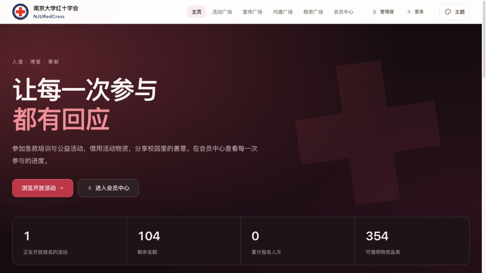

<div align="center">


# NJURedCross

### 南京大学红十字会 · 校园公益共建平台

**让每一次参与，都有回应。**

连接志愿者、活动负责人和校园伙伴，共同建设开放、友善、可靠的公益服务平台。

[体验平台](https://njuredcross.cn) · [快速开始](#快速开始) · [参与共建](CONTRIBUTING.md) · [共建团队](CONTRIBUTORS.md) · [文档](docs/README.md)

[](https://github.com/WANGLEVY9/NJURedCross/actions/workflows/ci.yml)
[](LICENSE)
[](package.json)
[](CONTRIBUTING.md)

</div>

---

## 一起把校园公益做好

NJURedCross 是由南京大学红十字会成员与开发者共同建设的开源项目。我们希望报名、审核、物资借用、内容分享和同伴互动都有清晰的入口，让参与公益更方便，让运营工作更有秩序。

这里欢迎代码，也欢迎产品建议、交互设计、测试、文档、可访问性改进与问题反馈。项目处于持续完善的 **Beta 阶段**；真实业务依赖独立配置的 NJUTable / SeaTable、账号与邮件服务。



## 我们正在建设什么

| 板块 | 面向参与者 | 面向运营者 |
| --- | --- | --- |
| 活动与志愿服务 | 活动筛选、报名、结果查询、请假与签到 | 申请审批、发布、名单确认、核验、时长审核与 Excel 导出 |
| 献血车专项 | 统一入口、周日历、点位筛选、满额心愿提醒 | 读取 NJUTable 自动生成岗位，查看名额与志愿者情况 |
| 宣传广场 | 内容与作品投稿 | 投稿审核、排期与发布登记 |
| 内建广场 | 生日祝福、早安晚安同行名片、兴趣筛选与留言 | 祝福与名片审核、举报处理、成员管理 |
| 物资广场 | 物资查询与借用申请 | 借用审批、库存、出库、归还与流水 |
| 会员与管理员中心 | 个人资料、本人参与记录与账号设置 | 权限范围、工作区偏好、系统状态与运营总览 |

公众端与管理端共享设计系统，兼顾 PC 和移动端。后端负责权限、容量和业务状态校验；公众接口不展示其他参与者的私有身份信息。功能配置与边界见 [正式数据连接](docs/PRODUCTION_DATA.md)、[早安晚安](docs/MORNING.md) 和 [测试指南](docs/TESTING.md)。

## 快速开始

需要 **Git、Node.js 22.13+ 和 npm**；建议使用 `.nvmrc` 指定的 Node.js 24。

```bash
git clone https://github.com/WANGLEVY9/NJURedCross.git
cd NJURedCross
npm ci --ignore-scripts
npm run preview
```

打开 <http://127.0.0.1:3000> 查看界面。此模式无需凭据，不连接 NJUTable 或 SMTP；业务请求会显示未配置提示。

如需在合成数据中体验活动流程：

```bash
npm run preview:workflow
```

打开 <http://127.0.0.1:3121>。这是内存演示环境，不代表生产鉴权与外部服务验收。

运行项目检查：

```bash
npm run verify
```

完整业务联调请按照 [运行指南](docs/GETTING_STARTED.md) 配置独立测试环境。已有 `.env` 请保留并按需编辑；生产凭据与真实资料不进入仓库。

## 参与共建

- **发现问题**：提交 [Bug 报告](https://github.com/WANGLEVY9/NJURedCross/issues/new?template=bug_report.md)，说明场景、复现步骤与预期行为。
- **提出想法**：通过 [功能建议](https://github.com/WANGLEVY9/NJURedCross/issues/new?template=feature_request.md) 描述谁会使用、解决什么问题、如何验收。
- **讨论方案**：在相关 Issue 中交流产品、设计与开发思路，让背景与结论便于其他伙伴查阅。
- **贡献改进**：从自己的主题分支发起 PR；小范围提交，附实际验证结果，界面修改可使用合成数据截图。

无需业务数据权限也可以参与界面、文档和合成回归建设。协作流程见 [CONTRIBUTING](CONTRIBUTING.md)，交流约定见 [CODE_OF_CONDUCT](CODE_OF_CONDUCT.md)。安全问题按 [SECURITY](SECURITY.md) 私下报告。

## 技术与项目结构

前端采用 **原生 JavaScript ES Modules 与 CSS**，共享组件、主题与动效，无需前端构建工具。后端使用 **Node.js 原生 HTTP**，连接 SeaTable SDK、Nodemailer 等服务。测试包括 Node 原生测试、Playwright 桌面/移动端回归和 Python 发布安全检查。

```text
server.js       服务组装、会话、权限与业务路由
lib/            身份、活动、内建、邮件与数据适配
public/         公众端、管理端、共享组件与样式
scripts/        检查、界面预览、迁移与发布工具
tests/          合成业务、浏览器与发布安全回归
docs/           架构、设计、运行与运营指南
reports/        按日期保存的验证摘要与历史记录
.github/        CI/CD、协作者通知与协作模板
```

| 常用命令 | 用途 |
| --- | --- |
| `npm run check` / `npm run lint` | 模块、文档链接与代码规范检查 |
| `npm test` / `npm run verify` | 权限、身份与业务回归；verify 包含检查与 lint |
| `npm run test:browser` | 桌面和手机 Chromium 回归，首次运行需安装 Playwright 浏览器 |
| `npm run dev` | 在已配置的隔离业务环境中启动开发服务 |
| `npm run smoke:public` | 公众页面、静态资源与匿名权限的只读冒烟 |

更多工具见 [脚本目录](scripts/README.md)。涉及真实数据的脚本请先阅读其作用与目标环境。

## 质量与发布

[GitHub Actions](https://github.com/WANGLEVY9/NJURedCross/actions) 覆盖 Node.js 22/24 × Linux/Windows、桌面与手机浏览器、发布包和回滚安全。质量门禁通过后，`main` 推送会自动部署；生产发布清单记录提交与文件哈希。代码部署、环境配置与数据库迁移分别管理。

其他开发者使用分支与 PR；Owner 已授权的维护按仓库约定完成检查后直接推送 main。CI 结果汇总至 [状态议题](https://github.com/WANGLEVY9/NJURedCross/issues/7)，通知配置中的协作者。

服务当前以单实例为基础：跨表写入不等于数据库事务，多实例锁、真实邮件投递、容量与恢复演练仍需专项验收。志愿新增明细与旧历史累计的对账规则见 [正式数据说明](docs/PRODUCTION_DATA.md)。

## 共建者与协作者

感谢每一位为 NJURedCross 付出时间与热心的开源伙伴。无论是代码、设计、测试、文档，还是一次建议与反馈，你的贡献都让这个项目变得更好。很高兴与你们一起，把校园公益做好。

<table>
<tr>
<td align="center"><a href="https://github.com/Anntharv"><br /><sub><b>Anntharv</b></sub></a></td>
<td align="center"><a href="https://github.com/centriole0413"><br /><sub><b>centriole0413</b></sub></a></td>
<td align="center"><a href="https://github.com/Daily-6"><br /><sub><b>Daily-6</b></sub></a></td>
<td align="center"><a href="https://github.com/Klein-Morett"><br /><sub><b>Klein-Morett</b></sub></a></td>
<td align="center"><a href="https://github.com/Nport-hut"><br /><sub><b>Nport-hut</b></sub></a></td>
</tr>
<tr>
<td align="center"><a href="https://github.com/pace-ys-xv"><br /><sub><b>pace-ys-xv</b></sub></a></td>
<td align="center"><a href="https://github.com/Rouin101"><br /><sub><b>Rouin101</b></sub></a></td>
<td align="center"><a href="https://github.com/WANGLEVY9"><br /><sub><b>WANGLEVY9</b></sub></a></td>
<td align="center"><a href="https://github.com/xinyue-L01"><br /><sub><b>xinyue-L01</b></sub></a></td>
<td align="center"><a href="https://github.com/zhoumiaoooooo"><br /><sub><b>zhoumiaoooooo</b></sub></a></td>
</tr>
</table>

完整名单、署名方式与更新说明见 [CONTRIBUTORS](CONTRIBUTORS.md)。代码贡献记录见 [GitHub Contributors](https://github.com/WANGLEVY9/NJURedCross/graphs/contributors)。设计、测试、文档和讨论同样是项目建设的一部分。

## 文档与许可

[文档导航](docs/README.md) · [架构](docs/ARCHITECTURE.md) · [设计系统](docs/FRONTEND_DESIGN.md) · [测试](docs/TESTING.md) · [部署与回滚](docs/OPERATIONS.md) · [更新记录](CHANGELOG.md)

本项目源码采用 [Mozilla Public License 2.0](LICENSE)。代码许可不包含南京大学红十字会的品牌授权，也不提供业务数据或生产服务访问权。请保留原作者与第三方许可信息。
