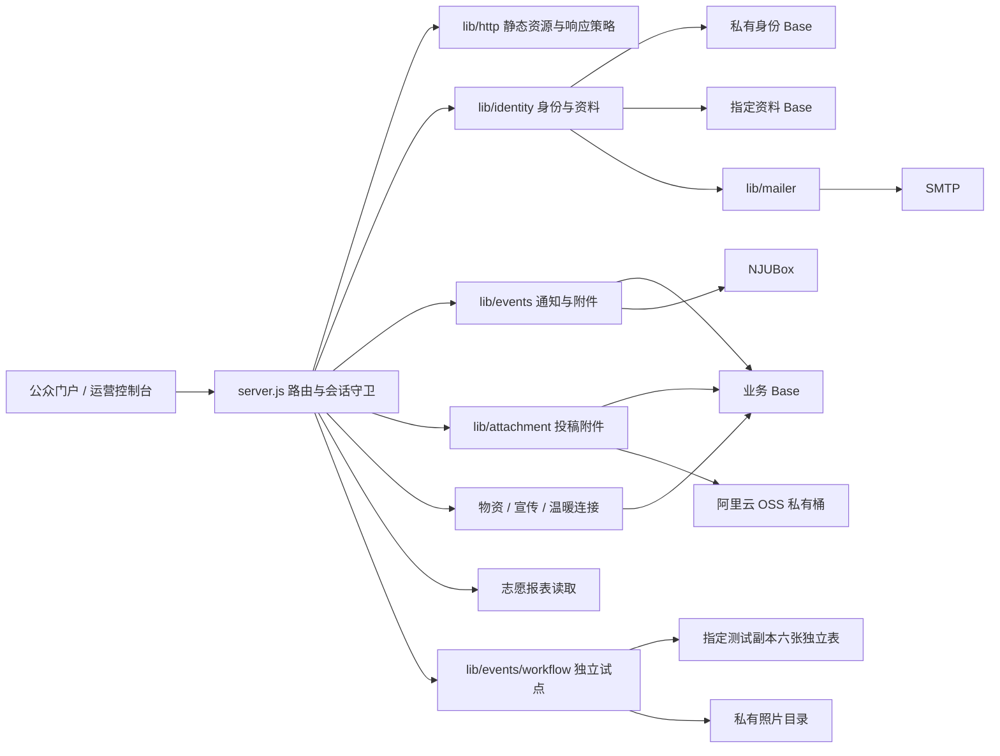

# 代码架构与数据边界

当前是一个按业务域划分模块的单体 Node.js 应用。两个浏览器界面使用同一 HTTP API；部署为单实例。前端无构建过程，后端使用 ES Modules 和顶层 await 装载账号。

## 模块职责

| 路径 | 职责 | 约束 |
| --- | --- | --- |
| `server.js` | 配置、连接组装、会话/CSRF、权限与业务路由 | 入口，不能被前端或离线测试导入以免启动真实服务 |
| `lib/http/response.js` | CSP、安全响应头、JSON 策略 | 不依赖业务数据 |
| `lib/http/static.js` | 静态文件、SPA 回退、ETag | 仅提供 `public/` 下文件；不读取配置文件 |
| `lib/seatable-auth.js` | 合并并发认证、到期前刷新、失败后重试 | 主业务、志愿、身份和资料连接统一使用 |
| `lib/permissions.js` | 控制台权限范围与路径映射 | 服务端裁决，前端隐藏按钮不代表授权 |
| `lib/identity/` | 哈希口令、邮箱验证、账号、身份绑定与资料同步 | 私有 Base 不通过通用行/元数据接口暴露 |
| `lib/events/` | 通知、附件、原表核对、献血车及独立试点 | 通过显式上下文调用会话与数据访问能力 |
| `lib/attachment/` | 内容投稿附件：表契约、OSS V4 签名适配与门户/审核 HTTP 域路由 | 浏览器只与本站通信（服务端中转）；OSS 未配置时上传端点 503 降级，不落半条记录 |
| `lib/mailer.js` | 邮件传输、幂等检查与发送记录 | 生产不能退回日志发码 |
| `public/app/core/` | API、路由、状态、DOM、格式与动效 | 不引入任何服务端模块或 Token |
| `public/app/ui/` | 跨界面的组件与交互 | 对业务数据源无直接依赖 |
| `public/app/portal/` / `console/` | 双界面外壳与页面编排 | 都通过 `core/api.js` 访问同源服务 |

## 请求与身份

页面由 `public/index.html` 加载 `public/app/main.js`。客户端先读取 `/api/auth/session` 再执行路由/界面守卫。服务端仍对每个受保护 API 校验会话、角色/权限与写请求的 CSRF。账号角色与托管字段不能从个人资料源获取授权。

业务数据、账号凭据、志愿报表读取、受测试 UUID 门禁保护的试点写入和资料写连接按用途隔离。账户的 `scrypt` 哈希、邮箱验证与业务关联记录保存在私有身份 Base。资料映射要求已验证邮箱、学号/姓名一致以及稳定的账号绑定；冲突关闭自动同步并要求人工核验。资料写入先保存私有值再按白名单同步源表，失败保留待同步状态。详见专项文档和合成回归。

## 依赖方向和扩展规则

前端：`main → shell/page → core/ui`。后端：`server → domain/http`，业务域可以依赖独立工具和显式上下文，不能反向导入 `server.js`。脚本与测试调用领域函数，独立管理输入。

新的业务域沿用 `lib/<domain>/api.js` 路由接口，以显式 `ctx` 注入会话、数据源、审计和响应能力。边界检查先于数据写入；禁止从调用方接收任意 Base、任意表名或账号标识来替换会话身份。

## 渐进整理顺序

本轮抽出了无业务依赖的 HTTP 层，修复所有长运行连接的认证入口。其余业务路由仍在 `server.js`，不能把文档中的目标当作已完成结构。下一步按物资 → 宣传 → 温暖连接拆分；每一步保持 API、表结构和异常语义，补故障与权限回归后再发布。多实例之前必须处理进程内锁、限流、会话撤销与跨表一致性。

## 新增领域模块

`workflow.js` 管理申请版本、名单、签到和明细恢复；`workflow-api.js` 校验 HTTP 会话、权限、CSRF 与本人归属；`blood-roster.js` 从模板生成整周申请；`attendance-photo.js` 私有保存并受控读取照片；`hours-export.js` 十列草稿预览。`volunteer-workflow.js` 读取旧表关联、派生核验状态；`safety.js` 提供单实例队列和完整读取门禁。

`identity/challenges.js` 处理验证码创建时间相同的排序歧义，拒绝多个最新待使用码；`http/errors.js` 将上游认证失败转换为数据服务不可用，避免错误清空用户会话。`core/api.js` 配合处理上游错误与 CSRF 重试。真实流程边界见 [试点指南](WORKFLOW.md)。

`attachment/api.js` 是域路由的现役范例：`attachmentRoutes(req, res, url, ctx)` 在 `/api/public/` 兜底之前拦截，`ctx` 注入 json/行存储/会话守卫/审计/限流/归属校验；投稿绑定时序为"先投稿行、后回填附件"，不引入事务假设。表契约与状态机见 [投稿附件专项](SUBMISSION_ATTACHMENTS.md)。
