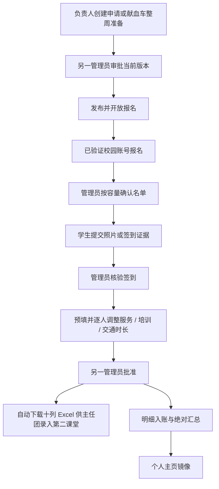

# 志愿活动与献血车试点

## 范围与开关

学生入口 `/workflow-events`，管理入口 `/console/workflow`，个人中心独立显示试点时长。必须配置 `PLATFORM_TEST_WORKFLOW=true` 且志愿 Base UUID 与代码中的指定测试副本一致；真实认证返回的 UUID 也需一致。默认关闭。当前版本不能任意切换到正式库。

这是独立流程，不是旧活动总表/累计时长系统的自动迁移。旧历史、资料同步和试点汇总不得相加后冒充正式年度时长。

## 生命周期



申请批准前不能发布；负责人不能批准自己的申请或核对后的时长。批准绑定版本与摘要，来源或证据改变时停止入账。容量确认和事件写入在单实例队列内执行。

## 献血车与请假

整周排班读取既有星期/点位/班次模板组合，不扩展为全点位笛卡尔积。负责人明确输入日期、业务周次、容量和三类时长；不把班次长度直接当作志愿服务时长。同班次重复准备复用记录，规则变化需明确处理。

报名防班次重叠；请假需审批，审批前占用名额且禁止签到，批准后释放名额。替补限两周内的开放且有名额班次，仍经负责人确认。停点关闭新报名和照片签到，展示原因。

普通活动签到窗口为活动当天；献血车为对应班次起止时刻，使用北京时间。当前没有自动宽限。照片内容的日期/真实性由管理员判断。

## 数据、文件和恢复

| 独立表 | 用途 |
| --- | --- |
| 网站活动流程表 | 申请、准备、批准版本、发布与停点 |
| 网站活动报名总表 | 稳定账号归属、名单、请假与签到照片引用 |
| 网站活动签到表 | 报名关联与核验记录 |
| 网站服务时长明细表 | 幂等键、来源摘要、三类时长与批准/入账状态 |
| 网站志愿时长汇总表 | 从明细重建的绝对汇总 |
| 网站个人主页表 | 试点时长镜像 |

照片支持 JPEG/PNG/WebP，最多 4MB；默认生产目录 `/var/lib/njuredcross-evidence`，目录 700、文件 600，访问限本人/活动管理员并禁缓存。该目录单独备份；代码回滚不能恢复丢失照片。

入账从持久化明细重建绝对总量，合成回归覆盖重复调用与跨表半成功后的恢复。它依然不是跨表原子事务或多实例锁；冲突需停止自动操作并核对。

管理端「签到核验」提供搜索、状态筛选、排序、逐人编辑和批量确认。三类时长及工作内容按活动配置预填；普通活动支持管理员人工核验，签到说明不要求逐人填写。献血车仍要求照片证据，请假待审批的参与者不能签到。活动结束后仍可补做管理员核验。

「时长审核与导出」显示第二课堂使用的十列明细，支持批量审核和说明原因后退回。退回后在签到核验页修改并重新提交。核对人或参与者不能批准自己的记录，沿用现有 `super_admin` 例外；接口从会话获取身份及角色，不接受客户端覆盖。审核与修改绑定核对摘要，防止审核过时的数据。批次最多 200 人，每人独立返回结果，部分失败可修正后重试。

审核成功后自动下载真实 `.xlsx`；也可用「下载已审 Excel」重试下载。文件只包含已批准/已入账记录，保持姓名、院系、学号、具体工作地点、正式工作日期、培训时长、交通时长、服务时长、志愿者具体工作内容、备注这十列。下载不会向第二课堂提交数据；由主任团按原流程录入。同步个人记录仍为独立操作。

新版明细用 `v2:` 来源摘要及核对摘要保护实际时长和工作内容；旧明细继续按原活动规则校验，编辑后升级。部署前，`网站服务时长明细表` 需增加三个 text 列：`工作内容`、`核对摘要`、`退回原因`。Schema 脚本先只读预览，明确授权后再增列，不删除旧列或重写历史明细。回滚前先备份；新版明细应完成处理或保留新版本，因为旧代码无法识别 `v2:` 明细。

## 开发与运维

```bash
npm run preview:workflow
npm run test:node
npm run workflow:schema:preview
```

前两项使用合成环境；第三项需要 `.env` 和指定测试副本，只读预览。`apply-workflow-schema.mjs --apply` 会真实建表/加列；`smoke-workflow-test-base.mjs` 一启动便向六张表追加合成记录，不默认清理。它们不进入普通 verify，不在生产随意执行。

在 PowerShell 用 `$env:PREVIEW_SUPER_ADMIN='1'; npm run preview:workflow` 可体验合成签到、退回、审核及 Excel 下载；预览服务仅监听本机，重启重置记录，不连接真实 Base。

正式迁移前确定唯一写入者，处理旧周期脚本消费范围、历史半成功和调整凭证，再做完整学生端与管理员端验收。历史专项记录见 [流程实施记录](../reports/WORKFLOW_IMPLEMENTATION_2026-10-04.md)。
