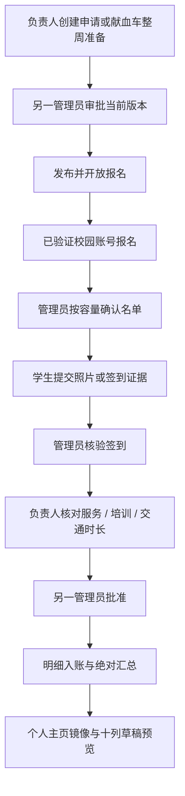

# 志愿活动与献血车试点

## 范围与开关

学生入口 `/workflow-events`，管理入口 `/console/workflow`，个人中心独立显示试点时长。必须配置 `PLATFORM_TEST_WORKFLOW=true` 且志愿 Base UUID 与代码中的指定测试副本一致；真实认证返回的 UUID 也需一致。默认关闭。当前版本不能任意切换到正式库。

这是独立流程，不是旧活动总表/累计时长系统的自动迁移。旧历史、资料同步和试点汇总不得相加后冒充正式年度时长。

## 生命周期



申请批准前不能发布；负责人不能批准自己的申请或核对后的时长。批准绑定版本与摘要，来源或证据改变时停止入账。容量确认和事件写入在单实例队列内执行。

## 献血车与请假

整周排班读取既有星期/点位/班次模板组合，不扩展为全点位笛卡尔积。负责人明确输入日期、业务周次、容量和三类时长；不把班次长度直接当作志愿服务时长。同班次重复准备复用记录，规则变化需明确处理。

报名防班次重叠；请假需审批，审批前占用名额且禁止签到，批准后释放名额。替补限两周内的开放且有名额班次，仍经负责人确认。停点关闭新报名和照片签到，展示原因。

普通活动签到窗口为活动当天；献血车为对应班次起止时刻，使用北京时间。当前没有自动宽限。照片内容的日期/真实性由管理员判断。

## 数据、文件和恢复

| 独立表 | 用途 |
| --- | --- |
| 网站活动流程表 | 申请、准备、批准版本、发布与停点 |
| 网站活动报名总表 | 稳定账号归属、名单、请假与签到照片引用 |
| 网站活动签到表 | 报名关联与核验记录 |
| 网站服务时长明细表 | 幂等键、来源摘要、三类时长与批准/入账状态 |
| 网站志愿时长汇总表 | 从明细重建的绝对汇总 |
| 网站个人主页表 | 试点时长镜像 |

照片支持 JPEG/PNG/WebP，最多 4MB；默认生产目录 `/var/lib/njuredcross-evidence`，目录 700、文件 600，访问限本人/活动管理员并禁缓存。该目录单独备份；代码回滚不能恢复丢失照片。

入账从持久化明细重建绝对总量，合成回归覆盖重复调用与跨表半成功后的恢复。它依然不是跨表原子事务或多实例锁；冲突需停止自动操作并核对。

十列导出当前为供人工核对的 JSON/界面草稿，保留服务、培训和交通分列；不声称已生成或上传正式 Excel 文件。

## 开发与运维

```bash
npm run preview:workflow
npm run test:node
npm run workflow:schema:preview
```

前两项使用合成环境；第三项需要 `.env` 和指定测试副本，只读预览。`apply-workflow-schema.mjs --apply` 会真实建表/加列；`smoke-workflow-test-base.mjs` 一启动便向六张表追加合成记录，不默认清理。它们不进入普通 verify，不在生产随意执行。

正式迁移前确定唯一写入者，处理旧周期脚本消费范围、历史半成功和调整凭证，再做完整学生端与管理员端验收。历史专项记录见 [流程实施记录](../reports/WORKFLOW_IMPLEMENTATION_2026-10-04.md)。
