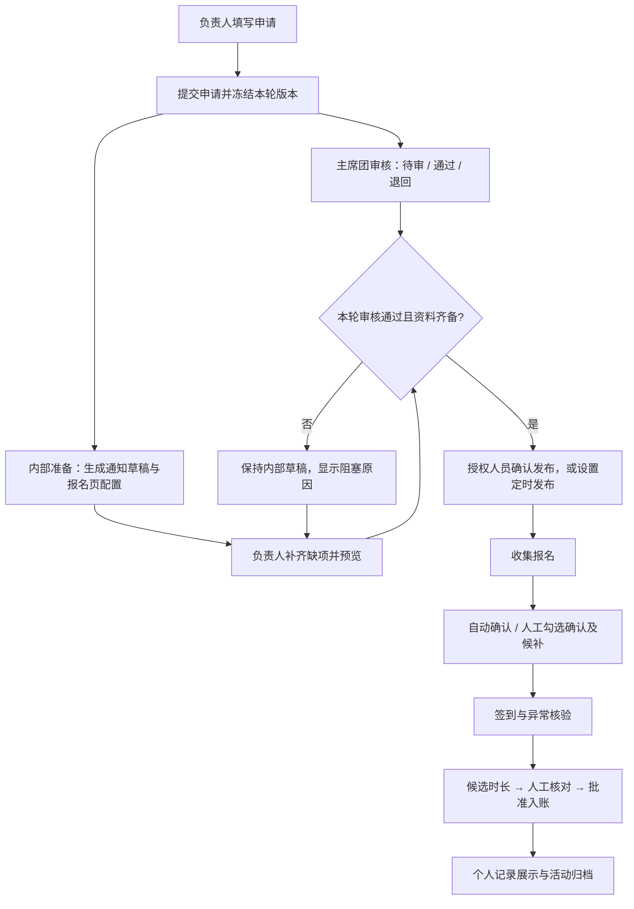

# 管理端白天模式与活动全流程开发方案

日期：2026-10-03。基于本地版本 `7a56f92` 的源码核对与需求截图；本文件是方案，不代表功能已实现或已部署。此次未修改运行代码、真实表结构和学生数据。

## 1. 需求理解与建议范围

需求方希望将「负责人申请 → 通知撰写 → 报名表制作 → 勾选成功报名人 → 签到 → 志愿时长录入」整合到同一个活动工作区。审核耗时不应阻塞内部准备，但审核通过必须是正式发布的前提。

建议分为两条工作线：

- **界面优化**：管理端默认固定白天模式，保留红十字会品牌红；覆盖登录、导航、所有业务页面、弹窗与移动端。
- **业务整合**：保留现有活动与报名能力，补建申请审批、筹备任务、名单确认和时长核算；先跑通网站内闭环，再接入既有 NJUTable 流程。

首版不增加深浅模式开关，避免继续维护两套管理端主题；后续有明确需求再增加。用户本次要求先制定方案，白天模式也纳入第一阶段实施范围。

## 2. 当前能力与实际缺口

| 环节 | 本地代码已有 | 本次需要完善 |
| --- | --- | --- |
| 管理端设计 | 统一颜色变量、桌面导航、手机侧栏与抽屉 | 深色管理端令牌改为浅色，逐页检查对比度、弹层与图表 |
| 活动创建 | 新建草稿、活动基本信息、容量与公开范围 | 面向负责人的申请入口、负责人归属与提交记录 |
| 立项审核 | 志愿服务页读取既有「登记审批」等表作展示 | 独立审核状态、审核意见、退回、重提及发布前校验 |
| 筹备材料 | 固定框架通知生成、预览、草稿存储、附件引用/上传 | 申请提交后自动创建准备任务、草稿版本与失败重试 |
| 报名表 | 网站已有活动报名页，表中预留「报名答案」 | 简单表单模板、配置预览、必填校验与配置版本冻结 |
| 报名名单 | 按容量确认/候补、代报名、取消 | 可选人工筛选模式、勾选确认、批量预览与容量校验 |
| 签到 | 报名二维码、管理员核验、重复签到拒绝 | 严格限制确认名单、签到窗口；补签理由与留痕 |
| 志愿时长 | 志愿服务页只读展示待核对记录 | 候选时长生成、人工核对、批准、幂等入账、个人记录展示 |
| 既有表联动 | 志愿 Base 只读展示，资料 Base 有专门映射模块 | 核对既有字段/脚本/公式，建立活动与报名映射，明确写入目标 |

证据入口：`public/styles/tokens.css`、`public/styles/admin.css`、`public/app/console/pages/events.js`、`public/app/console/pages/volunteers.js`、`lib/events/api.js`、`lib/events/notice.js` 与 `server.js` 的活动路由。

注意：现有通知发布接口只是把通知标记为「已发布」，并不证明邮件、QQ 或微信已送达。现有活动发布接口也未校验活动审批结果。这两点需要随新流程补齐。

## 3. 白天模式设计规格

| 项目 | 建议规格 |
| --- | --- |
| 页面底色 | 浅灰 `#F5F6F8`，降低大面积纯白的眩光感 |
| 工作面板 | 白色 `#FFFFFF`，用分隔线与轻阴影区分层次 |
| 侧栏 | 浅灰 `#EEF0F3`，选中项使用淡红背景与红色标记 |
| 正文 | 深灰 `#20242B`；辅助文字 `#5E6672` |
| 品牌主操作 | 深红 `#C31F35` 配白字，仅用于主要操作和当前选中状态 |
| 状态 | 待审核：琥珀；准备中：蓝；通过：绿；退回：红；同时显示文字与图标 |
| 排版与交互 | 延续现有字体和间距系统，手机正文/输入字号保持易读；点击目标至少 44px |

实施位置：先修改 `[data-surface="console"]` 的语义变量，包括背景、文字、边框、阴影、骨架屏、遮罩、语义状态与 `color-scheme: light`，再检查共享组件。不要直接套用门户的暖色布局，以免降低管理端数据阅读效率。

重点检查：表格悬停/选中、禁用按钮、输入占位与错误提示、图表坐标、命令面板、通知中心、抽屉、确认弹窗、原生日期控件、滚动条。摄像头预览等本身适合黑底的媒体区域单独保留。

桌面保留侧栏和列表/详情工作区；手机采用列表进入详情、分组标签和底部主操作区，避免长时间同时挤压列表与表格。长表格可横向滚动，但页面本身不应横向溢出。状态待办优先展示，减少手机上的无关统计占屏。

验收：360/390/430/768/1440px 宽度逐页截图；登录页、活动、物资、志愿、宣传、社区、数据和设置均覆盖；检查普通文字对比度至少 4.5:1、键盘焦点和加载/空/错误状态；管理端路由直接打开及刷新无深色闪屏。

## 4. 活动流程：审核与准备并行

将状态拆开，避免「准备完毕」被误当作「审核通过」：

- **审批**：草稿、待审核、退回修改、审核通过、审批拒绝。
- **准备**：未生成、生成中、待补充、准备完成、生成失败。
- **活动运营**：未发布、报名中、名单确认、进行中、待核时长、已归档；撤回/取消单独处理。

提交后先持久化申请，再创建可重试任务。自动准备使用模板，缺失联系人/地点/时间时显示待补项，不自行编造内容。首版无需 AI 生成依赖。

发布接口统一校验：当前版本通过审批、必要字段完整、场次与容量有效、报名时间有效、通知/表单版本一致、操作者有权限。公众列表、活动详情直链和报名 API 都检查同一发布资格；隐藏按钮不能替代服务端检查。

审核通过后的默认动作是「可发布」，首版由授权人员确认或预先设置定时发布，不自动对外群发。活动信息发生重要变化（时间、地点、容量、范围、时长规则）后使旧审批失效；通知文案的小改动保留版本与审计。

## 5. 页面方案

活动中心提供「我的申请 / 待我审核 / 筹备中 / 报名中 / 待核时长 / 已归档」视图，按权限显示。

活动详情作为唯一工作区，顶部显示活动名称、负责人、审批结果、准备进度和下一步动作。下方分为：

1. **申请与审核**：申请内容、附件、审批意见、版本对比、退回与重新提交。
2. **通知与报名页**：实时预览、缺项清单、模板字段、发布时间；区分通知发布状态和实际投递状态。
3. **报名与名单**：场次、容量、已确认、候补、待筛选，勾选名单和批量操作预览。
4. **现场签到**：已确认人员核验、异常提示、人工补签及理由。
5. **时长与归档**：候选值、证据、调整理由、核对结果、入账状态与失败重试。

报名表首版只支持文本、单选、多选等简单字段，避免先开发任意拖拽表单系统。通过现有身份绑定预填姓名、学号、邮箱；对外只展示必要活动信息。

## 6. 报名筛选与时长规则

每个活动选择一种名单模式：

- **先到先得**：沿用容量确认/候补逻辑，并修复并发问题。
- **人工筛选**：报名提交后为「待筛选」，不提前宣称录取；负责人勾选人员后预览容量与冲突，提交后变为「已确认」或「候补/未入选」。

发布前固定名单模式；开始收集报名后不随意切换。确认操作按活动/场次串行检查容量、取消状态与重复身份；跨场次是否允许重复报名需制定明确规则。名单确认和通知发送分开记录，发送失败不回滚已经确认的名单；重试不能重复发信。

时长生成仅是建议，不能把「一次签到」直接当作已完成全部服务。按活动配置固定时长，或在具备签退证据后按起止时间核算；扣除休息、迟到/早退及异常项，由负责人员核对、授权人员批准。未参加、取消、未入选不计入正常候选名单；补录走异常核验流程。

正式入账以「账号ID + 活动ID + 场次ID + 时长类型」标识防重。更正已入账时长保留调整记录，不删除原始证据；个人主页展示「待核对 / 已确认 / 更正中」和明确来源。

## 7. 数据与权限设计

建议复用已有活动项目、场次、报名、通知与附件表；增量补充申请版本、审批、报名配置、任务及服务时长记录。具体是否独立建表，必须先对照既有 NJUTable 结构和脚本，以下是逻辑模型而非立即建表清单。

| 逻辑对象 | 关键字段 |
| --- | --- |
| 活动申请/审批 | 申请ID、活动ID、负责人账号ID、申请版本、审批状态、审核人、意见、审核时间、批准版本 |
| 报名配置 | 活动ID、配置版本、名单模式、字段配置、冻结时间 |
| 筹备/发布任务 | 任务ID、活动ID、类型、源版本、目标版本、状态、重试次数、幂等键、执行结果 |
| 服务时长 | 记录ID、账号ID、活动ID、场次ID、证据引用、候选值、批准值、核对人、状态、入账目标、调整原因 |
| 既有表映射 | 源Base/表/行标识、目标业务ID、同步方向、来源版本、最后同步结果与冲突状态 |

账号权限仍从私有身份数据源裁决，不从志愿者部门、姓名或个人资料推导管理员权限。活动负责人、审批人、签到员、时长核对人是具体业务授权，不等于给账号全部管理员权限。首版建议负责人不审批自己的申请，普通用户只访问本账号报名与时长。

既有志愿 Base 当前代码为只读报表连接，不能直接把它改成全局读写客户端。资料同步使用已有专门写连接与字段白名单；新的活动/时长同步按用途设计独立能力。账户凭据、验证码和角色字段不进入业务表或公开通知。

跨 Base 不假设存在事务：采用持久化任务、稳定映射、幂等重试和对账；网站主记录提交成功而同步失败时显示「待同步」，保留重试能力。活动按稳定ID映射，人员按经验证的账号绑定映射，不使用姓名模糊匹配。

## 8. 开发顺序与验收门槛

| 阶段 | 工作 | 阶段验收 |
| --- | --- | --- |
| P0 基础修复 | 上次审查的上游错误语义、权限错误值、并发报名和截断读取；并行核对既有流程 | 故障/越权/并发回归通过，关键判断拒绝不完整数据 |
| P1 白天模式 | 主题令牌、共享组件、所有管理端页面和手机布局 | 全页面及弹层视觉验收；可单独发布，不等待大流程完工 |
| P2 最小闭环 | 申请、审批、模板草稿、报名页预览、服务端发布门禁 | 未批准不能从直链/API公开或报名；退回重提与版本失效可验证 |
| P3 名单与现场 | 人工筛选、容量校验、候补处理、通知任务、签到异常 | 批量重复提交不重复确认/发信，越权与超额操作被拒绝 |
| P4 时长与联动 | 时长候选、核对批准、入账、映射和对账 | 重试不重复累计；学生仅见自己数据；冲突可定位和处理 |
| P5 灰度验收 | 合成全流程、经授权的试点活动、备份、部署与回滚 | 负责人/审核人/学生实际验收，生产版本与数据来源核对 |

顺序上 P1 可作为较小的独立更新；P0 是整包上线和扩展报名功能的前置条件。每阶段交付可查看页面、数据/API契约和验收结果；本方案不把现有 153 项测试视为新流程已验收。

## 9. 实施前待核对内容

这些不影响先开展主题设计和合成原型，但影响真实建表与正式业务规则：

- 需求方现有 Table 中申请、审核、通知、名单、签到、时长对应的子表、字段、选项、脚本与公式；哪些属于权威源、哪些是汇总视图。
- 审批是否只需主席团一次确认、是否需要多人/分级审核，以及哪些改动要求重新审批。
- 哪些活动需要人工勾选录取，是否有资格条件、岗位/场次冲突与候补递补规则。
- 志愿时长采用固定值还是实际服务时段，最终由谁批准、写入哪张权威表。
- 实际发布渠道与责任人；QQ/微信首版可交付可复制文案并记录人工发布结果，不能把数据库状态当作渠道送达。

下一步建议先完成既有表流程的只读盘点与白天模式页面样稿，再实现申请到发布的最小闭环。所有真实迁移先提供 schema 差异和数据变更预览；此次方案不执行外部写入或部署。
