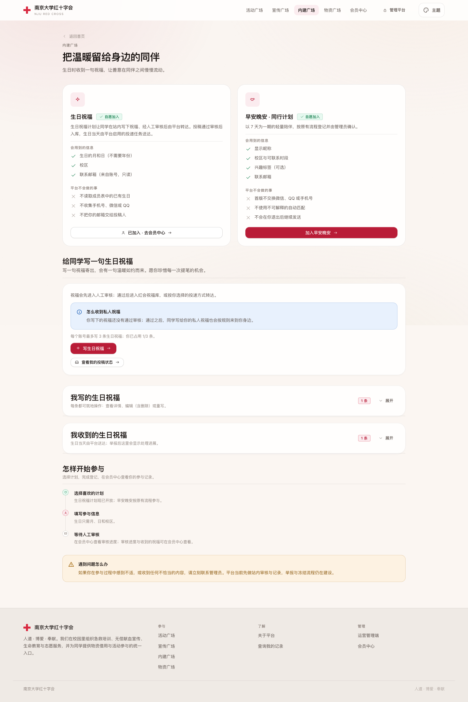

# 生日祝福选择性集成验收说明

日期：2026-10-09。目标分支：`codex/birthday-production-integration`。

## 基线与范围

基于远端 main `7c88f855f06e44fad3d9b5d6c68570841f6648ab`，选择性提取徐彧盛的 `feature-birthday-blessings`（`54ef8d1143484feb985384baa727a51b5a9aa0c6`）。不合并整条分支及其149个提交。主工作区现有未提交的 UI、工作流和安全改动保留在原处，未被本分支覆盖；合并前应将后续 main 更新重新核对。

包含生日参加/修改/退出、投稿和审核、祝福库、匹配、私人收件箱、举报和下架、管理视图及相关接口。保留 main 的活动流程、导航、主题、自定义选择器、身份与邮件模块。未导入测试凭据、测试重置脚本、全局生日弹窗、原分支的全站样式或依赖变更。早安晚安入口保留原流程。

## 默认关闭与兼容

`WARMTH_BIRTHDAY_ENABLED=false`、`WARMTH_DELIVERY_ENABLED=false`。生日开关关闭时沿用 main 的内建广场、会员中心和管理视图及旧接口。开启生日后先只读验证表结构；结构不完整时新接口拒绝处理，页面回退原入口。自动发送必须单独明确开启。生产环境强制要求持久化操作锁，不因配置关闭而降级为本地锁。

保留既有待确认记录。用户重新确认加入生日计划时更新原记录，不批量改变历史状态。生日发送按已完成的份数恢复部分失败批次，邮件沿用 main 的持久化幂等键。自动任务支持8点后补偿启动及失败重试。

## 正式 NJUTable 表结构决策

目标为正式管理 Base（见 `docs/PRODUCTION_DATA.md`），不是志愿服务 Base，也不是贡献者测试副本。以下为所需结构，已于2026-10-09读取正式 metadata 并按用户授权补齐：

| 表 | 操作计划 | 字段数 |
| --- | --- | --- |
| 温暖连接参加表 | 复用并核对 | 16 |
| 温暖连接投稿表 | 复用；缺失时补充署名昵称、投递方式、目标学号、投递条件、附件 | 16 |
| 温暖祝福库表 | 缺失时新建 | 11 |
| 温暖祝福投递表 | 缺失时新建 | 11 |
| 温暖祝福举报表 | 缺失时新建 | 10 |
| 温暖连接黑名单表 | 缺失时新建 | 8 |
| 温暖连接操作锁表 | 缺失时新建 | 8 |

字段定义以 `lib/production-schema.js` 为准。当前实现使用文本列；正式既有模块列已核对为text，没有类型冲突，不覆盖原列或原行。管理权限限定内建广场管理角色；普通用户只访问自己的参与信息和收件箱。继续使用既有身份库及邮件记录表。

本地 `.env` 指向测试 Base，已做的只读检查仅表明测试副本缺少上述5张新表及投稿表5列，不能推断正式库也缺少。初次 MR 阶段未创建正式表；2026-10-09用户确认后已新增5表、补投稿表5列并复核。未写业务行、未发送真实邮件、未部署。

服务器维护者可在正式服务器执行：

```sh
node --env-file=.env scripts/preflight-warmth-seatable.mjs --production
```

此命令要求文档中的正式管理 Base UUID，鉴权后再次比对实际 Base；只读 metadata 和至多每表一行，不输出行内容或 Token。失败不会创建表。创建和补列需确认目标和备份后另行实施，不直接执行通用批量建表脚本。

## UI 与本地验证

采用项目 Impeccable 的细节与一致性检查。新组件沿用 main 的字体、色彩 token、抽屉、表单和自定义选择器，移除原分支的装饰渐变、独立衬线字体、玻璃感及居中弹窗。管理操作在移动端持续可见，标题和按钮正常换行，早安晚安未被替换成开发占位页。

合成数据浏览器检查：用户端内建广场、会员中心、管理端内建广场分别在1440px和390px检查，无横向溢出或 JavaScript 错误；另检查移动投稿抽屉和管理4个标签页。数据均为合成，浏览器 API 拦截没有生产读写。




代码验证：`npm run verify` 通过，135项 Node 测试通过（另含权限、身份和资料契约检查）；新增开关默认关闭、结构不完整拒绝写入及部分投递恢复回归测试。测试覆盖为本地合成和接口/源码契约，不等同正式 NJUTable、SMTP 或多实例验收。

## 合并与启用前的门槛

1. 审阅本 MR，核对 main 后续改动；保持草稿状态至兼容性审阅通过。
2. 正式 Base 结构已核查、备份并补齐5表和5列；仍需核对服务器运行配置，不复制测试数据。
3. 在受控验收账号上检查生日参加、投稿审核、退出/黑名单、跨用户收件箱隔离和举报下架。
4. 在单实例受控环境检查锁表不可用时拒绝写入、进程中断重试、SMTP失败、重复运行和8点任务。锁表基于租约和复核，尚无跨客户端原子条件写入证明，不启用多实例生日写入/自动发送。
5. NJUTable写入与SMTP非同一事务。邮件已送达而记录写入失败仍需断点故障验收，不宣称恰好一次。

代码合并不等于部署或启用。回滚先关闭两开关并重启服务，恢复原页面与接口；保留新表和历史记录，不删除或自动迁移。需要代码回滚时回退本 MR 的合并提交。

## 2026-10-09 正式结构实测与执行

用户已明确同意增量建表。正式管理Base鉴权匹配；变更前80表，变更后85表。温暖连接参加表保持16列，投稿表从11列补到16列，5张新表字段与定义一致；7张生日相关表均为0行。完整预检通过，重复增量预览无待执行项。所有原表列名称、类型及key对比无非计划变更。

执行脚本为 `scripts/apply-birthday-schema.mjs`，默认只读预览；应用需 `--apply --confirm=CREATE-NJU-RC-BIRTHDAY-SCHEMA`，同时强制正式管理UUID及NJUTable域名，不做行级写入。结构备份在忽略目录，未提交。

未合并main、未部署、未改服务器或根目录.env、未启用生日/自动邮件。正式连接探查不等同服务器配置核对；根目录.env仍指向测试业务库。本次使用独立私有临时凭据，未复制进源码。
