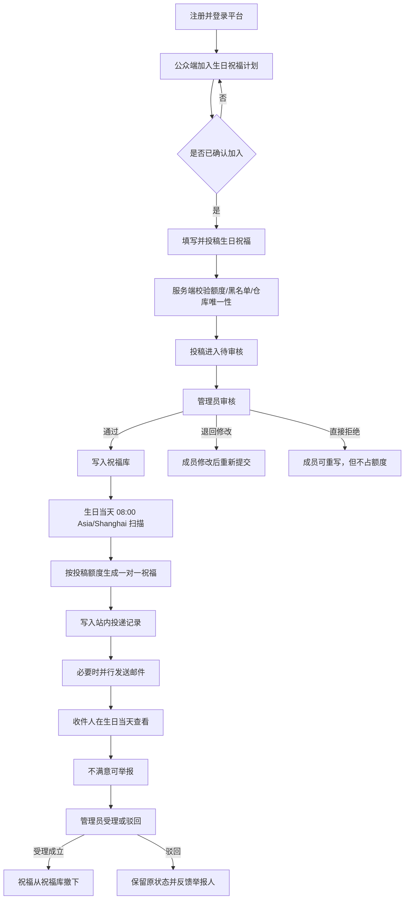
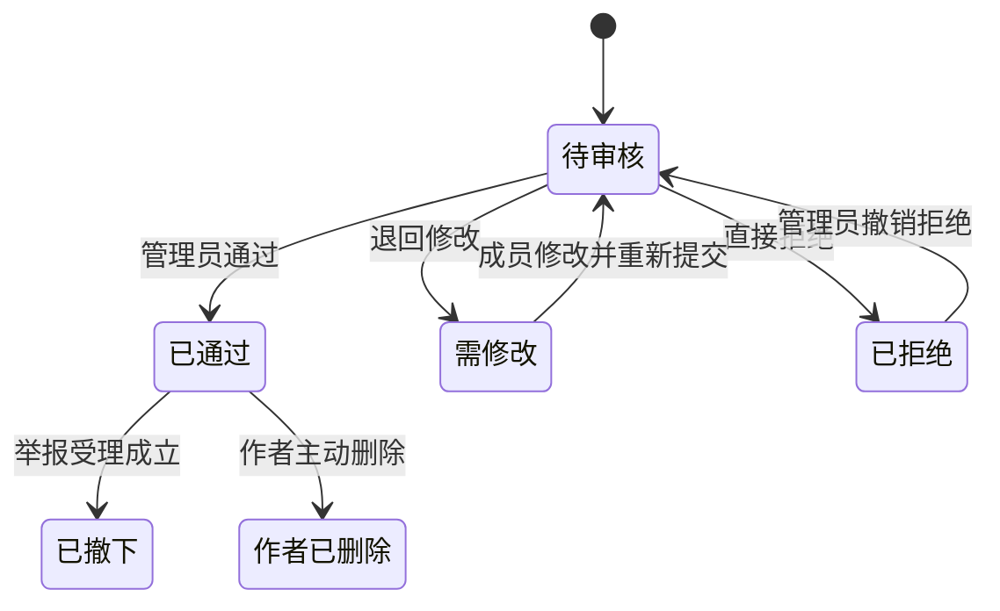
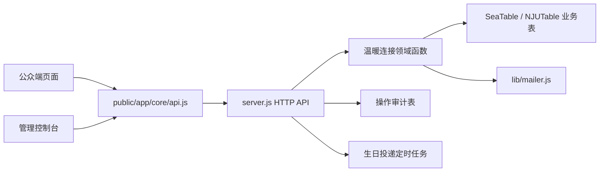

# 温暖连接（生日祝福）模块现状与交付说明

> 面向对象：总负责人  
> 更新日期：2026-10-08  
> 当前分支：`local/submission-status-entry`  
> 当前提交：`8fe30a1 fix(a11y): 补齐温暖连接渲染态审计修复`  
> 文档口径：只把已经在代码中实现、并有测试或真实本地接口证据的能力列为“已实现”；只有页面、接口或本地模拟表、尚未接入正式环境的能力单独标注。
> 本文中的“验证”指本地自动化测试或本地模拟接口验证，不等于正式生产环境验收。

## 一、一页结论

温暖连接当前用于承载校园同伴互助项目，现阶段真正投入建设的项目是“生日祝福”。模块已经形成从自愿加入、投稿、审核、入库、生日当天投递、收件查看、举报处理到拉黑退出的完整代码闭环。

当前状态可以概括为：

| 维度 | 结论 |
| --- | --- |
| 业务链路 | 主链路已经实现，可在本地模拟 SeaTable 环境完整运行 |
| 公众端 | 已实现加入、投稿、审核进度、修改重提、删除、收件查看、举报、退出 |
| 管理端 | 已实现参与人员、投稿审核、举报处理、祝福库、匹配预览、成员资料、拉黑与解除 |
| 数据与并发 | 已实现投稿上限、祝福仓库唯一性、投递幂等和审计；跨进程租约锁代码已完成，正式锁表待配置 |
| 自动化验证 | `audit:warmth` 正式违规规则为 0，但仍有人工复核对比度项；`test:birthday` 10/10；`verify` 整体通过，其中 Node 回归 119/119 |
| 生产前置 | 正式 NJUTable/SeaTable、SMTP、操作锁表和真实环境验收尚未完成 |
| 早安晚安 | 已暂停开放，页面保留“开发中”提示 |

结论：生日祝福模块已经具备进入正式联调的基础，但还不能把本地模拟通过等同于正式上线完成。上线前应优先完成正式数据源、邮件、租约锁表和多实例运行策略。

## 二、状态口径

本文使用以下四种状态：

| 状态 | 含义 |
| --- | --- |
| 已实现并验证 | 代码存在，已通过自动化测试或本地接口验证 |
| 已实现待配置 | 代码存在，但依赖正式环境参数、外部账号或运营配置 |
| 规划中 | 已进入开发计划，但当前没有完整实现 |
| 已暂停 | 当前不继续开发，页面和接口只保留兼容或提示 |

注意：“已实现并验证”表示代码已通过自动化或本地模拟环境检查，不表示已经通过正式 NJUTable、正式邮箱和真实运营验收。

## 三、模块目标与边界

### 3.1 目标

让经过实名注册的成员自愿加入生日祝福计划，用同学写下的祝福替代无差别群发，并通过审核、投递、收件、举报和退出机制保证过程可控、可追溯。

### 3.2 数据边界

- 加入计划只需要生日月日和校区，不采集出生年份。
- 加入计划时不填写昵称；投稿时才填写对外署名昵称。
- 手机号、微信、QQ、身份证、银行卡不进入温暖连接业务表。
- 作者对其他成员匿名，对管理员保留账号级可追溯性。
- 公众端不提供“祝福库”浏览接口，只有收件人能看到投递给自己的祝福。
- 管理端成员资料抽屉只显示业务需要的账号资料和温暖连接统计，不显示身份证、银行卡、手机号、微信和 QQ。
- “祝福库”指保存已审核通过祝福的数据表；“祝福仓库”指其中一种可被多次调用的投递分类，不等同于整张祝福库。

## 四、运行逻辑

### 4.1 总流程

### 4.2 参与和投稿

1. 成员必须使用平台注册账号登录后加入。
2. 生日祝福采用月日选择器，支持闰日 `02-29`。
3. 校区限定为鼓楼、仙林、苏州、浦口。
4. 加入生日祝福计划即时生效，不进入管理员人工确认队列。
5. 加入之后可以再次修改生日月日、校区，也可以自助退出。
6. 投稿时必须填写署名昵称与正文，并确认内容由本人撰写且接受人工审核。
7. 每个账号最多同时保留 3 条进行中或已通过投稿。
8. “祝福仓库”每人最多一条。
9. 已拒绝投稿不占额度，可以在会员中心重写。
10. “指定学号”已下线；当前表单只保留“随机匹配”和“祝福仓库”。
11. 历史数据中仍可能保留“指定学号”字段，仅为兼容旧记录；历史指定投稿不换取新的一对一额度。

### 4.3 审核与状态

投稿状态机：

关键规则：

- 只有“待审核”状态可以作出通过、退回或拒绝决定。
- 退回和直接拒绝都必须填写审核意见或理由。
- “需修改”的投稿由成员修改后重新进入待审核。
- “已拒绝”的投稿只能由管理员撤销拒绝后重新审核。
- 审核通过后按投递方式写入祝福库。
- 举报受理成立会把祝福从祝福库撤下，但不能覆盖“作者已删除”状态。

### 4.4 生日当天投递规则

每天北京时间 08:00 运行生日祝福投递任务：

1. 找出当天生日、已确认加入且未被拉黑的成员。
2. 排除自己写的祝福。
3. 统计收件人已经通过审核的“随机匹配”和“祝福仓库”投稿数量。
4. 每有一条有效的“随机匹配”或“祝福仓库”投稿，就为其换取一条一对一祝福。
5. 优先从“一对一随机”池抽取，排除已经发过的祝福。
6. 随机池不足时，从“祝福仓库”池补足差额。
7. 完全没有写过，或者只写过已下线的指定投稿时，从祝福仓库随机抽取一条。
8. 每条投递写入站内投递记录；如果 SMTP 已配置，邮件作为并行通知通道。未配置或发送失败时，站内投递仍保留，并把邮件状态记录到投递表。
9. 幂等键为：`投稿ID + 收件人学号 + 触发年份 + 触发日期`。
10. 当天邮件失败的记录会在后续任务周期重试，成功过的不重发。
11. 当前代码默认自动执行每日投递；如果上线前要求改成管理员批次确认后发送，需要单独改造调度和人工确认界面。
12. 如果服务在配置小时整段停机，可能错过当日自动检查；管理端当前可以手动触发，但持久化任务和停机补偿仍列为上线前事项。

### 4.5 收件、举报与拉黑

- 收件人只能看到投递给自己的祝福。
- 收件详情显示祝福正文、署名昵称、写信人校区和粗粒度写信时间，不显示精确时间戳。
- 收件人可以对已送达祝福举报并填写理由。
- 同一收件人对同一条祝福只保留一条待处理举报。
- 管理员受理举报时填写处理意见，并撤下该祝福；后续不再参与新匹配或投递，但已经送达的副本仍保留在收件人记录中并标记为已撤下。
- 管理员驳回举报时保留记录，并把结论反馈给举报人。
- 举报人确认处理结果后，置顶提醒消失，记录仍保留在收件记录中。
- 拉黑会同时踢出参加登记、阻止重新加入和投稿，并发送邮件告知本人。
- 解除拉黑后，只恢复因拉黑或踢出产生的登记；如果成员此前是主动退出，不会自动覆盖其退出选择。

## 五、已实现功能

### 5.1 公众端与会员中心

| 功能 | 状态 | 主要行为 |
| --- | --- | --- |
| 项目说明 | 已实现并验证 | 展示生日祝福边界、隐私承诺和参与步骤 |
| 加入计划 | 已实现并验证 | 月日选择、校区选择、同意确认、加入后即时生效 |
| 修改计划 | 已实现并验证 | 会员中心修改生日月日和校区 |
| 自助退出 | 已实现并验证 | 退出后不再进入匹配和发送队列 |
| 投稿 | 已实现并验证 | 昵称、正文、投递方式、同意确认 |
| 投稿上限 | 已实现并验证 | 每账号最多 3 条，进行中与已通过占额度 |
| 审核进度 | 已实现并验证 | 展示待审核、需修改、已通过、已拒绝和审核意见 |
| 修改重提 | 已实现并验证 | 仅自己的、可编辑状态的投稿可以重新提交 |
| 删除投稿 | 已实现并验证 | 已通过投稿删除后退出投递池，已送达者仍可查看 |
| 我写的祝福 | 已实现并验证 | 列表、详情预览、编辑、删除、重写 |
| 我收到的祝福 | 已实现并验证 | 生日当天站内查看、举报、举报处理状态 |
| 作者送出通知 | 已实现并验证 | 自己写的祝福被送出时，站内弹窗提示对方昵称 |
| 生日当天提示 | 已实现并验证 | 生日当天弹出收件提示，按浏览器去重 |
| 移动端与无障碍 | 已实现并验证 | 响应式布局、键盘语义、焦点管理、对比度审计 |

### 5.2 管理端

| 功能 | 状态 | 主要行为 |
| --- | --- | --- |
| 参与人员 | 已实现并验证 | 正常成员、已退出、黑名单三类视图 |
| 成员资料 | 已实现并验证 | 账号、学号、邮箱、院系、年级、温暖连接统计 |
| 投稿池审核 | 已实现并验证 | 待处理、待修改、已通过、已拒绝 |
| 审核动作 | 已实现并验证 | 通过、退回修改、直接拒绝、撤销拒绝 |
| 举报处理 | 已实现并验证 | 未处理、已处理、已驳回，可连续处理 |
| 举报结果编辑 | 已实现并验证 | 可修改受理/驳回结果并通知举报人 |
| 祝福库 | 已实现并验证 | 按分类浏览、检索、查看入库记录 |
| 匹配预览 | 已实现并验证 | 展示预计配额、随机池、仓库池和风险提示 |
| 拉黑与踢出 | 已实现并验证 | 拉黑、踢出、解除、恢复登记 |
| 手动投递 | 已实现并验证 | 管理员可指定日期手动触发投递任务 |

### 5.3 服务端、可靠性与安全

| 能力 | 状态 | 说明 |
| --- | --- | --- |
| 账号鉴权 | 已实现并验证 | 成员和控制台账号使用同一会话体系 |
| CSRF 与会话守卫 | 已实现并验证 | 所有写接口校验来源、会话和 CSRF |
| 账号级限流 | 已实现并验证 | 加入、退出、投稿、举报分别按账号限流 |
| 输入清洗 | 已实现并验证 | 控制字符、双向控制符、长度和必填校验 |
| 投稿额度保护 | 已实现并验证 | 额度检查与写入放进同一临界区 |
| 祝福仓库唯一性 | 已实现并验证 | 同一账号最多一条祝福仓库 |
| 投递幂等 | 已实现并验证 | 按投稿、收件人、年份和日期去重 |
| 跨进程租约锁 | 已编码待配置 | 操作锁表未创建时自动降级为进程内锁 |
| 操作审计 | 已实现并验证 | 加入、退出、投稿、审核、投递、拉黑、举报均记录 |
| 分页读取 | 已实现并验证 | 运营汇总读取不再受 100/500/1000 行硬上限影响 |
| 邮件通知 | 已实现待配置 | 邮件路径已编码，正式发信依赖 SMTP 配置 |

## 六、代码框架

### 6.1 总体结构

### 6.2 后端

| 文件或区域 | 职责 |
| --- | --- |
| `server.js` 常量区 | 校区、投稿上限、投递方式、状态、表和锁常量 |
| `server.js` 数据适配函数 | 读取参加、投稿、祝福库、投递、举报、黑名单 |
| `server.js` 领域函数 | 入库、拉黑、解除、匹配预览、生日投递 |
| `server.js` 公众 API | 加入、修改、退出、投稿、重提、删除、收件、举报 |
| `server.js` 管理 API | 参与人员、投稿审核、举报、祝福库、成员资料 |
| `server.js` 定时任务 | 每天北京时间 08:00 检查并投递 |
| `lib/production-schema.js` | 温暖连接相关业务表结构声明 |
| `lib/mailer.js` | 邮件发送、开发日志降级、幂等发送记录 |
| `lib/permissions.js` | 控制台权限范围与社区模块访问控制 |

`server.js` 中与温暖连接有关的主要区域：

| 区域 | 行号范围 | 说明 |
| --- | ---: | --- |
| 常量和状态 | 257-310 | 校区、上限、投递、锁、举报、黑名单 |
| 数据读取与入库 | 319-547 | 投稿、祝福库、黑名单、举报、投递记录 |
| 生日投递 | 574-709 | 每日投递、额度换算、邮件重试 |
| 参加登记与匹配预览 | 1017-1120 | 参加关系、候选池、预计配额 |
| 跨进程锁 | 1298-1390 | 操作锁表、租约、释放、降级 |
| 公众端 API | 2606-3020 | 加入、投稿、审核进度、举报、修改、退出 |
| 管理端 API | 3526-3820 | 参与人员、举报、祝福库、成员资料、拉黑 |
| 定时任务 | 4059-4080 | 每天 08:00 触发并记录结果 |

### 6.3 前端

| 文件 | 职责 |
| --- | --- |
| `public/app/portal/pages/warmth.js` | 温暖连接主页、项目说明、加入抽屉、投稿入口、举报横幅 |
| `public/app/portal/pages/me.js` | 会员中心“我写的 / 我收到的”面板和生日资料修改 |
| `public/app/portal/warmth-panels.js` | 可折叠祝福列表、收件详情、编辑与删除入口 |
| `public/app/portal/blessing-drawer.js` | 新建和修改祝福的共享抽屉 |
| `public/app/portal/blessing-letter.js` | 祝福信件详情和举报对话框 |
| `public/app/portal/blessing-actions.js` | 删除已写祝福的共享动作 |
| `public/app/portal/warmth-options.js` | 校区、月份、日期和月日联动 |
| `public/app/portal/shell.js` | 生日当天弹窗、作者送出弹窗 |
| `public/app/console/pages/community.js` | 管理端参与人员、审核、举报、祝福库、匹配预览 |
| `public/app/core/api.js` | 公众端和控制台 API 客户端 |
| `public/styles/warmth.css` | 温暖连接专用视觉和无障碍样式 |

### 6.4 数据表

| 表名 | 用途 | 关键字段 |
| --- | --- | --- |
| `温暖连接参加表` | 参加关系、生日资料、校区和退出状态 | 登记ID、参与者标识、项目、生日月日、状态 |
| `温暖连接投稿表` | 学生投稿与审核结论 | 投稿ID、提交人、状态、内容、审核意见、投递方式 |
| `温暖祝福库表` | 审核通过后的可用祝福 | 入库ID、投稿ID、分类、内容、状态、来源投稿人 |
| `温暖祝福投递表` | 生日当天站内和邮件投递留痕 | 投递ID、投稿ID、收件人学号、触发年份、触发日期 |
| `温暖连接黑名单表` | 拉黑、踢出和解除记录 | 黑名单ID、参与者标识、学号、原因、状态 |
| `温暖祝福举报表` | 收件人举报与管理员处理 | 举报ID、投稿ID、举报人标识、状态、处理意见 |
| `温暖连接操作锁表` | 跨进程租约锁 | 锁ID、锁键、状态、过期时间 |
| `操作审计表` | 全流程操作留痕 | 审计ID、操作人、动作、对象、结果、时间 |

### 6.5 主要接口

公众端：

| 方法与路径 | 用途 |
| --- | --- |
| `POST /api/public/warmth/interest` | 加入生日祝福计划 |
| `POST /api/public/warmth/interests/:id/update` | 修改生日资料 |
| `POST /api/public/warmth/interests/:id/withdraw` | 退出计划 |
| `POST /api/public/warmth/blessings` | 提交祝福 |
| `GET /api/public/warmth/blessings/mine` | 查看自己的投稿和审核进度 |
| `POST /api/public/warmth/blessings/:id/resubmit` | 修改并重新提交 |
| `POST /api/public/warmth/blessings/:id/delete` | 删除自己的祝福 |
| `GET /api/public/warmth/blessings/delivered` | 查看收到的祝福 |
| `GET /api/public/warmth/blessings/sent` | 查看自己送出的祝福 |
| `POST /api/public/warmth/blessings/:id/report` | 举报收到的祝福 |
| `POST /api/public/warmth/reports/:id/acknowledge` | 确认举报处理结果 |

管理端：

| 方法与路径 | 用途 |
| --- | --- |
| `GET /api/community/interests` | 参与人员和统计 |
| `GET /api/community/submissions` | 投稿池 |
| `POST /api/community/submissions/:id/review` | 审核、退回、拒绝、撤销拒绝 |
| `GET /api/community/warmth-reports` | 举报列表 |
| `POST /api/community/warmth-reports/:id/:action` | 处理或驳回举报 |
| `GET /api/community/blessing-library` | 浏览祝福库 |
| `GET /api/community/matching-preview` | 匹配预览 |
| `GET /api/community/warmth-members/:ref` | 查看成员资料与温暖连接统计 |
| `POST /api/community/warmth-blacklist` | 拉黑成员 |
| `POST /api/community/warmth-blacklist/release` | 解除拉黑 |
| `POST /api/community/blessing-delivery/run` | 手动触发当日投递 |

## 七、验证证据

当前提交已经过以下验证：

| 命令 | 结果 |
| --- | --- |
| `npm run audit:warmth` | 正式违规规则 `0`；仅保留 axe 对比度 `needs-review` 人工复核项 |
| `npm run test:birthday` | `10/10` 通过 |
| `npm run verify` | 整体通过；包含 156 个 JS 模块、61 个 Markdown 文档检查，0 errors |
| ESLint | 通过，零警告 |
| 权限回归 | `26/26` |
| 身份回归 | `103/103` |
| 资料回归 | `28/28` |
| Node 回归 | `119/119` |

本地验收环境：

| 服务 | 地址 |
| --- | --- |
| 网站 | `http://127.0.0.1:3000` |
| 本地模拟 SeaTable | `http://127.0.0.1:3301` |

## 八、待开发与上线前事项

### P0：正式上线前必须完成

1. 使用正式 NJUTable/SeaTable 地址、UUID 和最小权限 Token 完成正式表映射。
2. 对正式环境执行 `warmth-lock:dry-run`，确认后创建 `温暖连接操作锁表`。
3. 配置真实 SMTP，验证校园邮箱收信、失败重试、退信和发送记录。
4. 至少用一个正式成员账号和一个控制台管理员账号，完整跑通加入、投稿、审核、投递、收件、举报、拉黑、解除。
5. 在真实手机和桌面浏览器完成移动端、键盘和对比度复核。
6. 确认多实例部署策略；在共享锁和其他共享状态完成前保持单实例运行。
7. 确认每日投递任务的持续运行方式、重启补偿和失败告警。
8. 完成备份恢复方案，并明确祝福正文、署名昵称、审核意见和举报记录的保留期限。

### P1：试运行期间完善

1. 增加投递批次看板、暂停发送和人工重试入口。
2. 增加运营统计：加入人数、投稿通过率、投递成功率、举报率和退出率。
3. 为举报处理和黑名单设置责任人、处理时限和升级提醒。
4. 增加正式环境备份、恢复、日志留存和数据清理策略。
5. 对祝福正文、署名昵称和审核意见明确数据保留期限。

### P2：后续扩展

1. 早安晚安项目仍处于暂停状态，后续如需开放，应重新确认匹配规则、人工确认和退出机制。
2. 电子留言墙、活动搭子等新项目应在生日祝福稳定后再接入。
3. 如需跨渠道通知，先完成邮件队列，再评估企业微信或公众号，不直接开放私人联系方式。

### 需要总负责人确认的问题

| 问题 | 影响 |
| --- | --- |
| 上线首月是否正式启用邮件，还是只站内展示 | 决定 SMTP、发送内容和运营答复口径 |
| 生日当天是否允许系统自动投递，还是必须管理员批次确认 | 决定调度、人工审核和值班责任 |
| 举报处理的责任人和时限 | 决定是否增加提醒、升级和停发机制 |
| 祝福正文、昵称和审核意见的保留期限 | 决定数据清理、备份和隐私说明 |
| 早安晚安是否继续搁置 | 决定后续排期和前端文案 |

## 九、风险与建议

| 风险 | 当前影响 | 建议 |
| --- | --- | --- |
| 正式数据源未接入 | 无法证明目标环境表结构、权限和性能 | 先做 dry-run，再做只读对账，最后开放写入 |
| 操作锁表未创建 | 多实例下仍存在绕过额度和重复投递风险 | 正式环境创建锁表前保持单实例 |
| SMTP 未配置 | 邮件不会真实送达 | 先完成内部地址试投，再开放给参与者 |
| 定时任务依赖单进程 | 整段停机可能错过投递时点；当前需管理员手动补跑 | 上线前明确重启补偿，后续迁移到持久化任务或独立 worker |
| 运营责任未落地 | 举报和黑名单可能长期无人处理 | 明确责任人、时限和升级路径 |

## 十、关键代码与文档索引

- `server.js`
- `lib/production-schema.js`
- `public/app/portal/pages/warmth.js`
- `public/app/portal/pages/me.js`
- `public/app/portal/warmth-panels.js`
- `public/app/portal/blessing-drawer.js`
- `public/app/portal/blessing-letter.js`
- `public/app/console/pages/community.js`
- `public/app/core/api.js`
- `scripts/apply-warmth-lock-schema.mjs`
- `scripts/smoke-birthday.mjs`
- `scripts/audit-warmth-a11y.mjs`
- `tests/birthday-wishes.test.mjs`
- `tests/warmth-lock.test.mjs`
- `docs/API.md`
- `docs/TESTING.md`

## 十一、建议汇报口径

建议向总负责人这样概括：

> 生日祝福模块已经完成核心业务闭环和本地验证，当前可以进入正式环境联调。现在的主要工作不是继续补页面，而是完成正式 NJUTable、SMTP、操作锁表和多实例部署策略。早安晚安暂缓。上线前需要明确邮件是否启用、投递是否需要人工批次确认，以及举报和黑名单的运营责任人。
