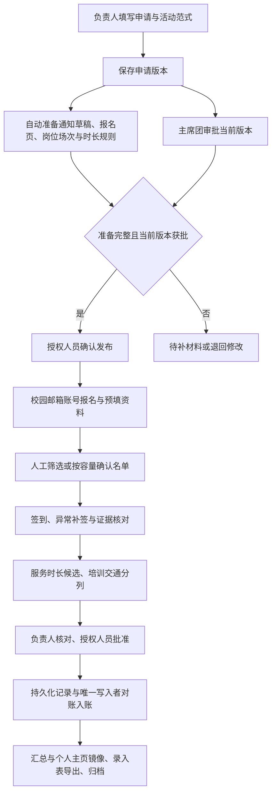

# 活动报名与志愿时长：第一轮实施及正式表核对

日期：2026-10-04。基于本地 HEAD `7a56f92` 的工作区增量；未推送、未部署。本轮真实学生行写入、脚本执行、外部邮件发送均为 0。

## 一、已实现内容与验收范围

| 进展 | 内容 | 证据与限制 |
|---|---|---|
| 已完成（本地） | 管理端默认白天模式：白色卡片、浅灰底、深色文字、红色主操作 | 共享主题令牌覆盖管理端；活动、志愿服务、时长抽屉用合成数据检查 360/390/430/768/1440px，无页面横向溢出。其余页面尚未逐页视觉验收 |
| 已完成（本地） | 上游鉴权故障与网站登录失效分开处理 | 上游 401/403 返回 503，不清除网站会话；只有 csrf_failed 才刷新 CSRF 并重试 |
| 已完成（本地） | 报名容量、重复报名、权限与不完整读取保护 | 公共/管理端活动写操作共用单进程队列；签到记录占用容量；无效非空权限不再扩大权限；关键操作拒绝截断数据 |
| 已完成（本地） | 志愿服务看板基于报名总表派生时长核对队列 | 按报名行 ID 和双向签到链接核对，不以显示名称模糊关联；源表录入状态与派生状态分列 |
| 已完成（本地） | 单条时长核对抽屉及服务端批量预览 | 每次重新读取来源；1～200 条，重号去重；没有正式入账按钮，不修改汇总/档案 |
| 已完成（服务端） | 沿用正式脚本十列的录入表草稿预览 | 可传 exportConfigId，仅明确关联的报名行可用；没有前端配置选择器、xlsx 文件上传或正式生成动作 |
| 开发中 | 申请版本、审批门禁、自动准备通知/报名表、人工筛选名单、持久化入账与更正 | 以下设计为实施约束及迁移预览，尚未形成正式生产闭环 |

单进程队列只约束当前网站实例；不能防止多个服务实例、SeaTable 脚本、人工表格操作同时写入，不能视为数据库事务锁。

## 二、来源核对：正式表与网站测试副本不同

后续补充核查：上一轮把副本列数写为 28，本轮与此前保存的 SDK 元数据对照，均为 27 列，列名未变化；已纠正这个计数。

| 来源 | 活动报名总表 | 其他已核对差异 |
|---|---|---|
| 网站配置的志愿 Base 测试副本 | 1,810 行、27 列（SDK 元数据） | 通知表名为“报名通知”；签到 251 行；个人主页 2,532 行 |
| 浏览器当前登录的正式志愿平台 | 2,989 行、37 列 | 通知表名为“活动报名通知”；签到 745 行；个人主页 2,806 行；登记审批 70 行；通知 207 行；导出配置 99 行 |

计数是本轮读取时的快照，后续可能变化。正式表通过登录页面查看列与脚本；测试副本通过服务器端既有凭据只读分页查询。没有替换凭据、复制真实学生行或执行正式脚本。仅核对脚本源码，不确认其实际调度和最近运行成功情况。

**测试副本聚合验证（不能当作正式表业务结论）**：源表已录入 646；需核验 25；待名单确认 1,013；待签到核验 126；双向关联且学号一致的报名签到 221；孤立签到 2。派生队列不代表最终志愿时长裁定。

正式报名表已看到的 37 列：序号、活动类别、活动名称、活动名称2、报名日期、报名时段、是否报名成功、学号、姓名、部门（新）、部门、性别、电话、QQ号、邮箱、急救证（新）、急救证、校区（新）、邮箱（新）、校区、院系、备注、备注2、签到表、岗位、志愿时长、录入状态、QQ群号、注意事项、邀请链接、献血量、图片、隐藏、体验反馈、问题反馈、修改时间、创建时间。

不能把“（新）”字段直接覆盖旧字段：其中包含链接/公式派生值，应分别确定权威字段、可写字段与历史保留策略。副本的“隐藏”为导出配置链接，不是可直接作为是否公开的布尔值。

## 三、报名与时长核心字段契约

| 字段/对象 | 含义与本轮处理 | 正式写入约束 |
|---|---|---|
| 活动类别、活动名称 | 活动范式与展示名称 | 引入稳定活动/场次 ID；同名不同日期不直接合并 |
| 报名日期、报名时段、岗位 | 到岗场次与分工 | 发布后冻结规则版本；岗位冲突与重复报名需预览 |
| 是否报名成功 | 原有勾选录取结果 | 仅布尔 true 视为名单确认；不从非空字符串推断成功 |
| 学号、姓名 | 原脚本按姓名+学号找汇总/档案 | 必须使用已验证账号关联；同学号异名/多档案冲突阻塞，不模糊匹配 |
| 签到表 / 签到记录的活动名称 | 双向行链接 | 核对链接行存在、学号相同、反向报名行一致；显示文字不替代 row_id |
| 志愿时长 | 原报名行的服务时长 | 有限正数才生成正常候选；缺值/零值待核定；不得从一次签到推断完整服务 |
| 录入状态 | 原脚本入口“待录入”与完成标记“已录入” | 当前仅展示；未来网站复核状态与脚本入口分开，避免填时长即被后台脚本消费 |
| 培训/交通/服务时长 | 录入 Excel 独立三列 | 保留分列，不自动相加到个人主页，不擅自确定学院计时政策 |
| 个人主页累计时长 | 汇总镜像及跨年度公式 | 保留公式、历史年度值；网站不直接做增量累加 |

派生状态：需核验 → 源表已录入 / 待名单确认 / 待签到核验 / 待核定时长 / 待录入。这里的“待录入”仅表示可以提供候选供人工复核；并不等于已批准入账。历史已录入行不会被要求追溯补造签到证据。

## 四、正式脚本的实际链路与风险

1. “活动报名总表 → 活动及时长汇总表”脚本只筛选录入状态=待录入。按姓名+学号定位汇总行，把报名时长**加到**旧汇总；再把报名行标记已录入。源码没有名单/签到/正时长校验。
2. 汇总更新成功而报名状态写入失败时，下一次运行可能再次累加。仅用已录入标记，不能解决跨表半成功。活动名称去重也不能防止时长重复。
3. “活动及时长汇总表 → 个人主页”脚本把累计时长**绝对赋值**到档案，并非再加一次。原有总时长/跨年度公式应保留。
4. Excel 脚本入口是“志愿时长录入excel生成”的是否生成表=待导出，目标附件为志愿时长录入表。源码选择报名成功且时长>0的报名行，没有本站新增的签到证据核验。
5. 导出十列依次为：姓名、院系、学号、具体工作地点、正式工作日期、培训时长、交通时长、服务时长、志愿者具体工作内容、备注。
6. 特殊活动范式：省红会组宣部、省血液献血车、校医院体检、校医院急救培训、康宇孤独症、工位值班。原脚本按姓名+学号合并多条记录，日期/时段拼接、服务时长求和，培训与交通配置值乘记录条数，并标记重复报名需人工核查。普通活动保留一条报名对应一行。本轮预览保留这些输出规则，并增加来源链接、签到、同学号姓名冲突与混入不同活动保护。

不能同时让网站和旧脚本增量入账。正式接入前必须指定唯一写入者，并完成历史状态对账；本轮没有停用、修改或执行任何原脚本。

## 五、全流程串联方案

审批与准备并行，但批准前不能公开通知、开放报名或触发时长入账。重要变更使原审批失效；个人修改资料不能改角色、已入账时长或历史服务证据。通知发布状态与实际渠道送达分开；首版可复制文案，不自动外部群发。

## 六、下一阶段迁移预览（未执行）

| 逻辑记录 | 建议字段 | 来源/写入边界 |
|---|---|---|
| 活动映射 | 源Base/表/行ID、活动ID、场次ID、模板类型、同步版本、状态 | 官网活动项目与既有登记审批/通知显式绑定；不按标题自动建关联 |
| 申请与准备任务 | 申请版本、批准版本、审批状态/人/时间、准备状态、任务幂等键、缺项、失败原因 | 优先扩展已有活动项目与持久化任务；公开 API 共用发布门禁 |
| 名单复核 | 原报名行ID、名单模式、当前版本、确认/候补结果、操作者、理由 | 不覆盖学生自行填写字段；是否报名成功由授权名单操作更新 |
| 服务时长明细 | 记录ID、账号ID、源报名行ID、源签到行ID、活动/场次ID、规则版本、服务/培训/交通时长、核对人、批准人、来源快照摘要、状态 | 增量独立记录；候选与批准分开；来源改变重新核验 |
| 入账与调整任务 | 幂等键、明细版本、目标汇总行、入账前值、预期值、实读结果、任务状态、失败原因、调整原因 | 必須单写入者。恢复时对照明细与目标值，半成功进入对账，不能盲目加一次 |

录入状态建议：草稿→待核对→待批准→待入账→已入账；异常进入需对账；更正以新调整记录处理。正式调用前重新读源行、确认身份关联、名单、证据、批准版本及数值未变。历史已录入行只建立基线，不自动重新累计。

下一批顺序：①正式/副本 schema 对照与稳定映射预览；②申请版本+审批发布门禁+自动草稿准备；③人工名单与签到异常；④明细账、唯一写入者改造与失败恢复；⑤导出配置选择器、正式文件生成、合成全流程与授权试点。真实迁移前展示具体字段差异和预计变更行数。

## 七、验证与上线结论

`npm run verify`：项目检查、ESLint、权限 21、身份 103、资料联动 28、Node 回归 20，共 **172 项通过**。新增检查涵盖容量为 1 的并发报名、活动/场次别名、重复邮箱、截断读取、已签到占位、上游故障会话、CSRF 重试、签到双向链接、异常时长、同名不同日期、导出分列与重复报名提示。全部以合成数据执行，真实写入/发送为 0。

验证中曾有一次既有身份测试“五次失败锁定修改密码验证码”未通过；随后独立重跑六次及最终全量运行通过，暂未复现或定位原因。这项间歇失败仍列入上线前排查，不以重跑通过代替根因定位。

响应式证据见 `day-mode-qa-20261004.json`；仅两页及其核对抽屉，不能据此宣称所有管理端页面视觉验收完成。服务端导出规则已测试，前端导出配置交互待开发。未做真实写入恢复、正式账号端到端、现网重启/冒烟与多实例并发测试。

**可交付本地第一阶段代码与预览；完整报名—时长闭环尚不具备直接现网切换条件。** 在测试副本/正式表来源差异、审批发布门禁、唯一入账写入者与真实验收完成前，不把本轮结果当作生产就绪证明。
