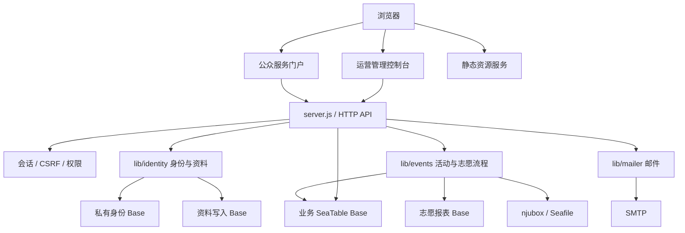
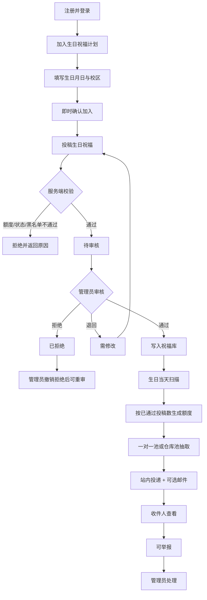
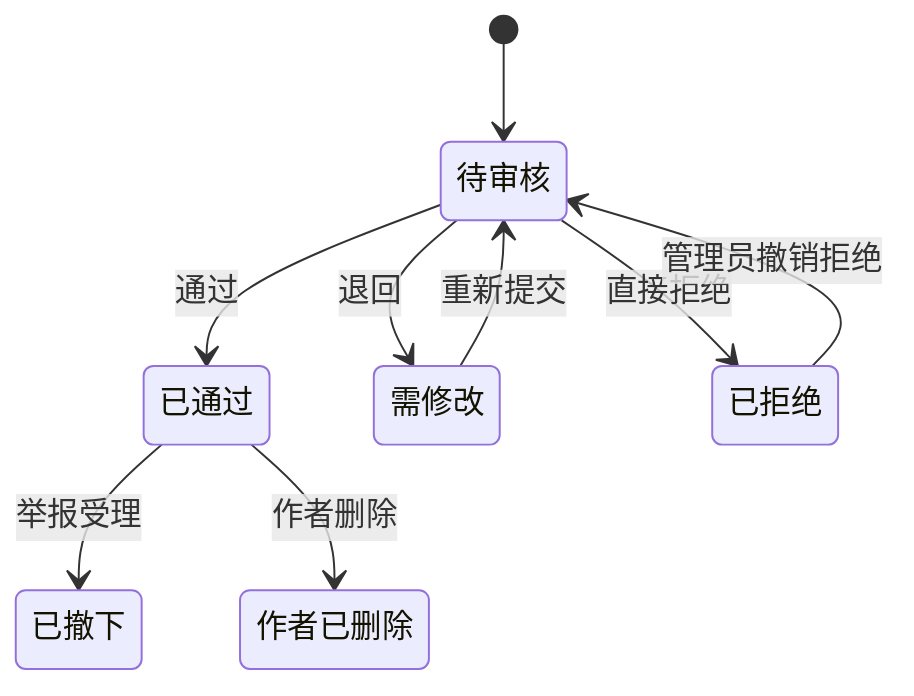

# 南京大学红十字会平台项目汇报书

## 逻辑介绍与代码解释

> 文档类型：项目汇报书 / 技术交接文档  
> 编写日期：2026-10-08  
> 当前分支：`feature-birthday-blessings`  
> 当前提交：`cae1e1c fix(warmth): 加固 SeaTable 预检与持久化锁恢复`  
> 主要读者：项目负责人、指导老师、后续维护者、前端 / 后端协作同学  
> 本文范围：整个平台的整体逻辑，并对温暖连接 / 生日祝福模块做重点代码解释

---

## 阅读说明

这份文档不是单纯的接口清单，也不是按文件逐行照抄代码。它按照项目的实际运行逻辑组织：

1. 先说明平台要解决什么问题、整体由哪些部分组成；
2. 再说明一次浏览器请求如何进入后端、如何完成鉴权、如何访问 SeaTable；
3. 然后按业务模块解释代码职责和数据边界；
4. 最后用较大篇幅解释生日祝福模块，因为它当前是开发最完整、逻辑最复杂、最需要交接的业务域。

文档中的“已实现”以当前代码、自动化测试和本地接口验证为依据。没有真实 UUID、正式 Token、SMTP 和多实例环境，就不能把本地模拟验证写成正式生产验收。

---

## 一、项目一句话概括

南京大学红十字会平台是一个基于 Node.js 原生长连接服务、原生 ES Modules 前端和 SeaTable 数据底的校园公共服务与运营系统。

平台同时提供两个界面：

- **公众服务门户**：面向普通学生，提供活动、物资、内容投稿、温暖连接、注册登录和个人中心等能力。
- **运营管理控制台**：面向管理员，提供物资、活动、志愿、宣传、温暖连接、数据中心和系统设置等能力。

两个界面共用一套服务端鉴权、会话、CSRF、权限和数据访问代码。浏览器永远拿不到 SeaTable Token；所有数据库访问都经过服务端代理、校验、脱敏和审计。

当前项目处于“功能 Beta”阶段：

- 平台基础架构、身份系统、权限系统和多个业务模块已经具备可运行代码；
- 生日祝福模块已经形成完整代码闭环；
- 正式 NJUTable / SeaTable、正式邮件、多实例部署策略、历史数据迁移和运营责任仍需要在真实环境验收。

---

## 二、项目当前进度总览

### 2.1 当前分支状态

| 项目 | 当前值 |
| --- | --- |
| 分支 | `feature-birthday-blessings` |
| 最新本地提交 | `cae1e1c fix(warmth): 加固 SeaTable 预检与持久化锁恢复` |
| 私有远端 | `private/feature-birthday-blessings` 落后本地 1 个提交 |
| 未跟踪文档 | `command.md`、若干 `reports/*.md`、`reports/PROJECT_PROGRESS_AND_PROMPTS_SYNC_2026-10-08.md` |
| 主要新增方向 | 温暖连接 / 生日祝福 |

### 2.2 当前验证结果

最近一次本地验证结果：

| 命令 | 结果 |
| --- | --- |
| `npm run verify` | 123/123 Node 回归通过；权限 26/26、身份 103/103、资料 28/28 |
| `npm run check` | 157 个 JavaScript 模块、65 个 Markdown 文档，0 errors |
| `npm run lint` | 通过，0 warnings |
| `npm run test:birthday` | 14/14 通过 |
| `npm run smoke:birthday` | 67/67 通过 |
| `npm run warmth:preflight` | 本地模拟 Base 上通过 UUID、表和列检查 |
| `npm run warmth-lock:dry-run` | 本地锁表结构完整，无缺失列 |

这些结果说明当前代码在本地模拟环境下可运行。它们不等于正式 SeaTable、正式邮箱、正式浏览器和真实运营流程已经验收。

---

## 三、项目要解决的问题

平台的核心目标不是做一个普通展示网站，而是把红十字会日常运营中用表格、邮件和人工协作完成的流程，转化为一个可追踪、可分权、可审计的网站系统。

主要问题包括：

1. **数据分散**：成员、活动、物资、宣传、温暖连接等数据可能分布在多个表格、文件和人工记录中。
2. **流程不可见**：报名、借用、投稿、审核、投递、举报等状态没有一个统一入口。
3. **权限难控制**：公众端和控制台需要不同角色，不能只靠前端隐藏按钮。
4. **敏感数据不能暴露**：SeaTable Token、身份凭据、邮箱、学号、照片等不能进入浏览器。
5. **操作需要留痕**：审核、投递、拉黑、举报处理等动作必须可以追溯。
6. **重复请求要幂等**：邮件、投递、报名、领用等不能因为重试产生重复记录。

因此项目采用“服务端业务状态机 + SeaTable 数据源 + 双前端界面”的总体方案。

---

## 四、总体技术架构

### 4.1 架构图



### 4.2 关键技术形态

| 项目 | 当前实现 |
| --- | --- |
| 后端运行时 | Node.js 22.13+，当前本地测试环境为 Node.js 24 |
| 后端框架 | 不依赖 Express，使用 Node.js 原生 `http.createServer` |
| 模块系统 | ES Modules |
| 前端 | 原生 JavaScript ES Modules + CSS，无构建工具 |
| 数据源 | SeaTable / NJUTable 自部署实例 |
| SeaTable SDK | `seatable-api` 1.0.46 |
| 邮件 | Nodemailer |
| 二维码 | `qrcode` |
| 测试 | Node.js 原生测试框架 + 合成 Base / 内存夹具 |
| 浏览器审计 | Playwright + axe-core |

### 4.3 为什么没有前端框架

项目刻意采用无构建前端，原因包括：

- 降低部署复杂度；
- 避免前端构建产物与源码不一致；
- 让浏览器直接加载模块，便于排错；
- 减少供应链依赖。

代价是：路由、状态管理、组件复用和可访问性都需要自行维护。因此项目中形成了 `public/app/core/` 和 `public/app/ui/` 两层共享代码。

---

## 五、仓库结构与代码职责

```text
server.js              主入口；配置、路由、会话、权限、部分业务逻辑
lib/                   可复用后端模块
  seatable-auth.js     SeaTable access token 生命周期
  production-schema.js SeaTable 表结构声明
  permissions.js       控制台权限范围
  mailer.js            邮件发送、幂等与发件留痕
  identity/            注册、登录、账号、资料同步
  events/              活动、通知、附件、献血车、志愿流程
  http/                HTTP 响应、静态资源、缓存、错误映射
public/                浏览器端源码
  app/core/            API、路由、DOM、状态、格式、主题
  app/ui/              通用 UI 组件
  app/portal/          公众门户
  app/console/         运营控制台
  styles/              设计系统与页面样式
scripts/               检查、预览、迁移、Schema、smoke、预检工具
tests/                 合成领域与基础设施回归
docs/                  持续维护的架构、API、测试、部署文档
reports/               日期性验证报告与交接材料
```

### 5.1 `server.js`

`server.js` 是当前项目最大的单体入口，承担：

- 读取环境变量；
- 初始化 SeaTable Base；
- 加载账号；
- 定义会话、CSRF、权限守卫；
- 分发 `/api/auth/*`、`/api/public/*`、`/api/portal/*` 和控制台 API；
- 实现部分业务领域逻辑；
- 启动静态资源服务和定时任务。

这是一种“单体应用 + 域模块逐步抽出”的结构。它不是最终理想形态，但对于当前 Beta 阶段更直接。

### 5.2 `lib/`

`lib/` 放置可以从入口中抽出的领域逻辑：

- SeaTable 鉴权生命周期；
- 身份存储与资料同步；
- 邮件发送与幂等；
- 活动通知、附件、献血车、时长导出；
- HTTP 通用能力；
- 权限范围。

这些模块不能反向导入 `server.js`，避免循环依赖。

### 5.3 `public/`

前端按“双界面 + 双共享层”组织：

- `public/app/core/`：API 请求、会话、路由、DOM 创建、主题、格式化、缓存。
- `public/app/ui/`：按钮、字段、抽屉、弹窗、表格等通用组件。
- `public/app/portal/`：公众门户壳、页面和业务流程。
- `public/app/console/`：控制台壳、页面和运营流程。

### 5.4 `scripts/`

脚本分为：

- 无数据访问：语法检查、项目检查；
- 在线只读：数据对账、preflight；
- 会写入：Schema 创建、清理、迁移、受控冒烟；
- UI 预览：本地静态 / 合成数据预览。

执行脚本前必须确认它是否写数据。默认原则是 dry-run，真实写入必须显式 `--apply` 和确认短语。

---

## 六、服务启动逻辑

### 6.1 启动顺序

服务启动时大致执行：

1. 读取 `.env`；
2. 校验 `SEATABLE_API_TOKEN` 和 `PLATFORM_SESSION_SECRET`；
3. 创建主业务 Base 客户端；
4. 按需创建身份 Base、资料 Base、志愿 Base 客户端；
5. 加载平台账号；
6. 初始化账号索引；
7. 启动 HTTP 服务；
8. 按配置启动定时任务。

### 6.2 SeaTable 连接分层

当前代码可能出现四个数据连接：

| 连接 | 环境变量 | 用途 | 写入边界 |
| --- | --- | --- | --- |
| 业务 Base | `SEATABLE_API_TOKEN` | 活动、物资、宣传、温暖连接等主数据 | 平台主要写入 |
| 身份 Base | `SEATABLE_IDENTITY_API_TOKEN` | 平台账号、验证码、绑定关系 | 私有身份数据 |
| 资料 Base | `SEATABLE_PROFILE_API_TOKEN` | 志愿者个人主页资料 | 指定写入 |
| 志愿 Base | `SEATABLE_VOLUNTEER_API_TOKEN` | 志愿报名、签到、时长等 | 只读 |

生产环境不能把身份数据退回到业务 Base 或本地 JSON。身份 Base 是独立安全边界。

---

## 七、一次请求如何进入代码

### 7.1 静态请求

如果请求路径不是 `/api/*`，服务交给静态文件处理器：

1. 检查路径安全；
2. 查找 `public/` 下文件；
3. 命中文件则返回；
4. 无扩展名路径回退到 `index.html`；
5. 由前端路由接管页面。

因此，页面切换主要发生在浏览器端，刷新时再由服务端返回入口 HTML。

### 7.2 API 请求

API 请求进入 `http.createServer` 后：

1. 判断路径是否以 `/api/` 开头；
2. 写请求成功后清理公开读缓存；
3. 对特定展示型 GET 请求启用请求内读取复用；
4. 进入 `api()`；
5. 根据路径分发到身份、门户、公众或控制台路由；
6. 路由内部完成鉴权、CSRF、输入校验和 SeaTable 操作；
7. 出错时由 `apiFailure()` 转换成对前端统一的错误格式。

### 7.3 API 分层

```text
/api/auth/*      登录、注册、验证码、密码、私有账号资料
/api/public/*    公众端可访问；读接口公开，写接口需登录
/api/portal/*    登录用户自己的记录
其他 /api/*      控制台接口，需要管理角色和权限范围
```

控制台写操作还需要 CSRF。服务端不会因为前端隐藏按钮就认为用户无权。

---

## 八、身份、会话和权限逻辑

### 8.1 账号来源

账号最初可以从本地 `.platform-accounts.json` 启动，但正式方向是 SeaTable 中的 `平台账号表`：

- 账号 ID；
- 登录名；
- 邮箱；
- `scrypt` 密码哈希；
- 角色；
- 显示名；
- 身份码；
- 状态；
- 失败次数、锁定时间、最近登录等安全字段。

生产环境要求独立身份 Base。密码不能明文存储，浏览器也不能访问身份 Base。

### 8.2 会话

登录成功后服务端签发 HMAC 签名的会话：

- Cookie 为 `HttpOnly`；
- 生产环境启用 `Secure`；
- `SameSite=Strict`；
- 默认有效期 8 小时；
- 修改密码后旧会话失效；
- 账号被停用后不能继续使用旧会话。

### 8.3 CSRF

所有写操作要求 `X-CSRF-Token`。CSRF token 和会话绑定，服务端使用 timing-safe 比较。

前端在 `public/app/core/api.js` 中：

- 自动为 POST / PUT / PATCH / DELETE 加 CSRF；
- 遇到 `csrf_failed` 时刷新会话并重放一次；
- 遇到 401 时清理本地会话状态。

### 8.4 角色与权限

服务端角色分为：

- `super_admin`；
- `platform_admin`；
- `member`。

管理控制台还按范围授权，例如：

- `materials`；
- `events`；
- `outreach`；
- `community`；
- `data`；
- `settings`；
- `accounts`。

前端会按权限加载导航和页面，但最终授权仍由服务端判定。

---

## 九、SeaTable 数据访问层

### 9.1 为什么 SeaTable 是核心

平台把 SeaTable 当作业务状态真源。这样做的收益：

- 运营人员可以直接在 SeaTable 中查看和修正数据；
- 服务端不依赖本地 JSON 文件；
- 数据权限、备份和审计可以围绕 Base 统一设计；
- 多个业务模块共享同一套数据协作能力。

代价：

- SeaTable 不是关系型数据库；
- 没有 SQL 事务；
- 没有唯一约束；
- 跨表写入不能保证原子性；
- 并发需要应用层补偿。

代码中所有“幂等”“锁”“完整读取”“状态机”都是为了弥补这些限制。

### 9.2 `createSeaTableAccess()`

`lib/seatable-auth.js` 负责 access token 生命周期。

逻辑：

1. 如果已认证且未到刷新时间，直接返回 Base；
2. 如果正在认证，复用同一个 Promise；
3. 认证后解析 JWT 过期时间；
4. 在到期前提前刷新；
5. 如果 token 已经接近过期，拒绝使用；
6. 对不透明 token 使用最大缓存时间。

这样避免每次请求都重新认证，同时避免长期使用过期 Token。

### 9.3 分页读取

`loadAllRows()` 按 500 行分页读取，最多读取配置上限。

关键点：

- 不把 100 行或 500 行当成全量；
- 当达到上限时会检查是否还有下一行；
- 数组上附着 `readMeta`，表示是否被截断；
- 对运营决策类读取，必须调用 `assertCompleteRows()`。

生日祝福专门使用 `warmthRows()`：

1. 按温暖连接表上限读取；
2. 检查是否完整；
3. 如果被截断，直接报错，不允许用部分数据做额度、查重、审核或投递。

### 9.4 Schema 管理

`lib/production-schema.js` 声明平台需要的表和列。

脚本分为：

- `apply-*schema.mjs`：创建表；
- `preview-*schema.mjs`：只读检查；
- `preflight-warmth-seatable.mjs`：温暖连接专用只读预检；
- `clean-test-rows.mjs`：清理测试行。

新脚本的规则是：

- 默认 dry-run；
- 写操作必须显式确认；
- 写前检查目标 Base UUID；
- 不覆盖已有表；
- 完成后重新读取 metadata 验证。

---

## 十、主要业务模块逻辑

### 10.1 活动模块

活动模块负责：

- 活动项目；
- 活动场次；
- 活动报名；
- 报名容量；
- 候补；
- 签到码；
- 签到核验。

主要数据表：

- `活动项目表`；
- `活动场次表`；
- `活动报名表`。

关键逻辑：

1. 管理员创建活动草稿；
2. 增加场次；
3. 发布活动；
4. 公众端查看公开活动；
5. 用户登录后报名；
6. 服务端检查容量、重复报名、公开状态和邮箱域名；
7. 成功后写入报名行和审计；
8. 签到凭证只返回明文一次，表中保存摘要。

### 10.2 物资模块

物资模块负责：

- 库存查询；
- 借用申请；
- 审批；
- 出库；
- 归还；
- 流失；
- 二维码；
- 照片；
- 逾期提醒。

核心表：

- `物资管理`；
- `工位物资表`；
- `物资配置表`；
- `物资流水表`。

库存不是直接修改一个数字，而是：

```text
当前数量 = 初始 / 现有基线 + 流水累计变化
```

出库和归还使用 `withMaterialLock()` 按资产编码串行化，防止同一进程内并发扣减。

注意：这个锁只覆盖单个 Node 进程，不是跨实例数据库锁。

### 10.3 宣传模块

宣传模块负责：

- 公众内容投稿；
- 遗留策划案、文创、课程反馈的统一展示；
- 审核；
- 发布排期；
- 发布结果；
- 附件引用。

数据来源：

- 三张遗留宣传表；
- `宣传投稿表`；
- `宣传发布任务表`；
- 志愿 Base 的报名通知。

### 10.4 志愿服务与独立试点

志愿模块主要读取旧志愿 Base，负责报名、签到、审批、时长和活动统计。

独立试点模块在 `lib/events/workflow*` 中实现，具有独立表结构和更严格的状态机：

- 草稿；
- 审批；
- 发布；
- 报名；
- 请假；
- 签到；
- 照片核验；
- 时长核对；
- 入账。

试点写入只允许在配置指定的测试 UUID 上进行。正式 Base 不能误启用试点写入。

### 10.5 邮件模块

`lib/mailer.js` 提供通用邮件发送：

- SMTP 配置后使用真实 SMTP；
- 非生产环境未配置 SMTP 时可以写开发日志；
- 生产环境未配置 SMTP 时拒绝用日志发验证码；
- 每封邮件写入 `邮件发件记录表`；
- 有幂等键的邮件先写“发送中”占位，再检查自己是否是最早占位；
- 发送失败不会抛出到业务调用方，而是返回 `ok:false`；
- 业务方根据返回值决定是否回滚或标记失败。

由于 SeaTable 没有唯一约束，这里的幂等是“先写占位再比较”，它降低重复概率，但不是数据库级原子锁。

---

## 十一、温暖连接 / 生日祝福模块

这是当前分支的核心开发内容，也是本文重点。

### 11.1 模块目标

让经过实名注册的成员自愿加入生日祝福计划，通过同学写下的祝福替代无差别群发，并保证：

- 自愿加入；
- 投稿可控；
- 管理员审核；
- 生日当天投递；
- 收件人可见；
- 可举报；
- 可拉黑；
- 可退出；
- 全流程留痕。

### 11.2 数据边界

- 只采集生日月日，不采集出生年份；
- 加入计划不填昵称；
- 投稿时填写对外昵称；
- 不采集手机号、微信、QQ、身份证、银行卡；
- 公众端不能浏览祝福库；
- 收件人只能看到投递给自己的祝福；
- 管理端成员资料不展示不必要的敏感字段。

### 11.3 总运行流程



### 11.4 数据表

| 表名 | 说明 | 关键字段 |
| --- | --- | --- |
| `温暖连接参加表` | 用户加入计划、生日、校区、退出/拉黑状态 | 登记ID、参与者标识、项目、生日月日、状态 |
| `温暖连接投稿表` | 成员投稿和审核结论 | 投稿ID、提交人、内容、状态、审核意见、投递方式 |
| `温暖祝福库表` | 审核通过后的可用祝福 | 入库ID、投稿ID、分类、内容、状态、来源投稿人 |
| `温暖祝福投递表` | 生日当天实际投递记录 | 投递ID、投稿ID、收件人学号、年份、日期、站内/邮件状态 |
| `温暖祝福举报表` | 收件人举报和管理员处理 | 举报ID、投稿ID、举报人标识、状态、处理意见 |
| `温暖连接黑名单表` | 拉黑、解除和原因 | 黑名单ID、参与者标识、学号、原因、状态 |
| `温暖连接操作锁表` | 跨进程租约锁 | 锁ID、锁键、状态、过期时间、创建时间 |

### 11.5 投稿状态机



核心规则：

- 只有 `待审核` 可以审核；
- 退回和拒绝必须有原因；
- `需修改` 允许本人修改并重新进入审核；
- `已拒绝` 不占投稿额度，但必须管理员撤销拒绝才能重新进入审核；
- 已通过祝福进入祝福库；
- 举报受理后不覆盖作者已删除状态。

### 11.6 后端代码解释

#### 常量和状态

温暖连接相关常量包括：

- 校区：鼓楼、仙林、苏州、浦口；
- 投稿上限：每账号 3 条；
- 投递方式：随机匹配、祝福仓库；
- 祝福库状态：在库、已撤下、作者已删除；
- 举报状态：待处理、已处理、已驳回；
- 黑名单状态：生效、已解除。

这些常量集中定义，避免多个接口各自写字符串。

#### `readWarmthBlessings()`

负责读取投稿表并转换为 API 视图。

主要处理：

1. 过滤 `项目 = birthday`；
2. 映射投稿 ID、内容、提交人、昵称、状态；
3. 保留审核意见；
4. 待审核时区分“当前审核意见”和“上一次审核意见”；
5. 按提交时间倒序。

#### `readBlessingLibrary()`

读取祝福库和投递表：

1. 找出已经站内投递过的投稿 ID；
2. 把随机匹配祝福标为“一对一已发过的”；
3. 把非在库状态都归为“已下线的”；
4. 返回给管理端祝福库页面。

#### `ingestApprovedBlessing()`

审核通过后写入祝福库：

- 以 `投稿ID` 查重；
- 已存在则更新；
- 不存在则新增；
- 根据投递方式分类为“祝福仓库”或“一对一随机”。

这是一个应用层幂等，因为 SeaTable 本身没有唯一键。

#### `runWarmthBirthdayDelivery()`

生日投递流程：

1. 计算上海时区当天月日和年份；
2. 对该日期加温暖连接持久化锁；
3. 读取参加关系、祝福库、已有投递；
4. 找出当天生日、已确认、未拉黑的人；
5. 对每个收件人计算其投稿额度；
6. 从一对一随机池匹配；
7. 池不足时从祝福仓库补足；
8. 写入投递记录；
9. 调用 `sendMail()`，邮件失败不撤销站内投递；
10. 重试当天未成功发送的邮件；
11. 幂等键为 `投稿ID + 收件人学号 + 年份 + 日期`。

#### 匹配规则代码

核心规则：

```text
收件人额度 = 本人已通过的“随机匹配 + 祝福仓库”条数
如果额度 > 0:
  从他人写的一对一随机池取 min(额度, 可用池)
  不足部分从他人写的祝福仓库补足
如果额度 = 0:
  从他人写的祝福仓库抽取 1 条
```

所有路径都排除自己写的祝福。

#### 举报逻辑

收件人举报时会校验：

- 当前用户是否是该祝福的收件人；
- 是否已经有一条待处理举报；
- 举报理由是否合法；
- 举报限流。

管理员处理时：

- 受理 → 祝福库状态变为已撤下；
- 驳回 → 保留祝福；
- 两种处理都会通知举报人；
- 举报人确认后隐藏置顶提醒。

#### 拉黑逻辑

拉黑会：

1. 统一参与者标识；
2. 写入黑名单；
3. 踢出当前生效登记；
4. 阻止重新加入和投稿；
5. 邮件通知本人。

解除拉黑只恢复因拉黑被踢出的登记，不覆盖用户主动退出的选择。

### 11.7 温暖连接持久化锁

### 为什么需要锁

SeaTable 没有唯一约束和事务，多个 Node 实例可能同时：

- 判断某用户额度未满；
- 同时写入第 3 条投稿；
- 同时投递同一批祝福；
- 同时处理同一举报；
- 同时拉黑或解除。

`withWarmthLock()` 用 SeaTable 行模拟租约锁：

1. 读取锁表；
2. 删除过期锁；
3. 找到当前锁键的活跃锁；
4. 如果没有活跃锁，写入自己的锁行；
5. 重新读取并选择最早锁行作为赢家；
6. 只有令牌匹配的实例进入临界区；
7. 释放时标记 `已释放`；
8. 长任务期间定时续租。

当前限制：

- 这是 best-effort 锁；
- 没有数据库级唯一约束；
- 不能完全排除 SeaTable 读取延迟导致的竞态；
- 真正多实例上线前必须用真实 Base 做并发验证。

最新加固包括：

- 锁表故障不再永久降级；
- `WARMTH_LOCK_REQUIRED=true` 时锁表不可用直接拒绝写操作；
- 锁表可用性有重试间隔；
- 临界区执行期间会续租。

### 11.8 SeaTable 预检

新增只读命令：

```powershell
npm run warmth:preflight
```

它会检查：

- `SEATABLE_BUSINESS_BASE_UUID` 是否配置；
- Token 指向的 Base 是否一致；
- 7 张温暖连接表是否存在；
- 每张表需要的列是否齐全；
- 每张表是否可以只读一行；
- 输出不包含 Token、Cookie 或原始业务数据。

失败输出只给出类似：

```json
{
  "ok": false,
  "error": "SeaTable request failed (ECONNREFUSED)"
}
```

不会把 Axios 配置对象和 Authorization 头直接打印出来。

### 11.9 前端代码解释

公众端温暖连接页面：

- `public/app/portal/pages/warmth.js`；
- `public/app/portal/warmth-panels.js`；
- `public/app/portal/blessing-drawer.js`；
- `public/app/portal/blessing-letter.js`；
- `public/app/portal/blessing-actions.js`。

公众端主要交互：

1. 查看规则和隐私边界；
2. 加入计划；
3. 修改生日资料；
4. 提交祝福；
5. 查看自己的审核状态；
6. 修改、重提或删除；
7. 查看收到的祝福；
8. 举报；
9. 确认举报处理结果；
10. 退出计划。

管理端温暖连接页面：

- `public/app/console/pages/community.js`。

包含：

- 参与人员；
- 投稿池；
- 举报处理；
- 祝福库；
- 匹配预览；
- 成员资料；
- 拉黑与解除；
- 手动投递。

### 11.10 生日祝福当前结论

生日祝福模块当前已经具备：

- 完整公众端流程；
- 完整管理端流程；
- 后端状态机；
- 祝福库分类；
- 投递算法；
- 幂等和锁；
- 举报和拉黑；
- 自动化测试；
- 本地 SeaTable 模拟验证；
- 正式 Base 只读预检。

它还缺：

- 正式 UUID / Token 环境验收；
- 正式 SMTP 验证；
- 多实例真实并发测试；
- 调度器停机补偿；
- 数据保留周期；
- 运营责任人和处理时限。

---

## 十二、前端总体逻辑

### 12.1 路由和壳

`public/app/main.js` 定义双界面路由：

- 公众端路由用 `portalPage`；
- 控制台路由用 `consolePage`；
- 控制台路由带有权限守卫；
- 页面模块按需动态加载。

每个界面有各自 shell：

- `public/app/portal/shell.js`；
- `public/app/console/shell.js`。

### 12.2 API 层

`public/app/core/api.js` 是唯一网络边界：

- 不暴露 SeaTable；
- 自动带 Cookie；
- 自动带 CSRF；
- 统一解析错误；
- GET 请求合并在途请求；
- 会话过期时刷新一次；
- 个人资料使用短期内存缓存。

### 12.3 UI 组件

`public/app/ui/` 提供：

- 按钮；
- 输入框；
- 抽屉；
- 弹窗；
- 表格；
- 分段控件；
- 图表；
- 命令面板；
- 主题选择。

设计目标是让公众端和控制台共用交互组件，而不是复制两份。

---

## 十三、安全设计

### 13.1 信任边界

```text
浏览器 → HTTP 请求 → 服务端校验 → SeaTable
浏览器 → HTTP 请求 → 服务端校验 → SMTP
浏览器 → HTTP 请求 → 服务端校验 → njubox
```

浏览器不可信。SeaTable 返回数据也不是全部可信，需要服务端投影和字段白名单。

### 13.2 主要安全控制

| 风险 | 控制 |
| --- | --- |
| Token 泄露 | Token 只在服务端 `.env`，不下发浏览器 |
| 越权 | 每次请求重新校验会话、角色和权限范围 |
| CSRF | 写请求必须携带会话绑定 token |
| XSS | 前端用 DOM 文本节点，不使用不可信 `innerHTML` |
| 注入 | SeaTable 字段按名称白名单写入，不拼接外部表名 |
| 重复提交 | 幂等键、状态检查、锁、前端 loading |
| 暴力登录 | 登录失败按 IP 限流 |
| 验证码滥用 | 哈希存储、冷却、尝试次数、一次性失效 |
| 敏感数据 | 私有身份 Base、字段投影、脱敏、日志限制 |
| 文件上传 | 类型 / 大小校验、随机文件名、私有目录 |
| 凭证日志 | 温暖连接预检和锁脚本不再输出 SDK 配置对象 |

### 13.3 数据最小化

平台设计强调：

- 只收集业务需要的数据；
- 不在公众接口返回他人信息；
- 不把身份证、银行卡、手机号、微信、QQ 放入温暖连接业务表；
- 管理端资料抽屉只展示运营需要的字段。

---

## 十四、可靠性与并发

### 14.1 幂等

项目中的幂等场景：

- 邮件：同一幂等键不重复发送；
- 生日投递：同一投稿 + 收件人 + 年 + 日只投一次；
- 报名：重复报名被识别；
- 物资流水：幂等键防止重复入账；
- 活动流程：同一请求重试不重复写明细。

### 14.2 锁

项目中的锁：

- `withKeyedLock()`：单进程内 key 锁；
- `withMaterialLock()`：单进程物资锁；
- `withWarmthLock()`：SeaTable 行租约锁，目标为跨进程；
- `withEventMutation()`：活动单实例串行队列。

这些锁解决不同层级问题，不能混为一谈。

### 14.3 失败语义

- 业务状态读失败：抛错，不能假装空数据；
- 审计写失败：只记录日志，不阻断主业务；
- 邮件失败：返回 `ok:false`，业务决定处理方式；
- 投递邮件失败：站内投递仍保留；
- 跨表半成功：通过状态字段、异常说明或待同步状态恢复。

---

## 十五、测试与验证

### 15.1 离线测试

```powershell
npm run verify
```

包括：

- 项目检查；
- ESLint；
- 权限测试；
- 身份测试；
- 资料测试；
- Node 测试。

### 15.2 温暖连接测试

```powershell
npm run test:birthday
npm run smoke:birthday
```

覆盖：

- 未加入不能投稿；
- 加入和重复加入；
- 审核进度；
- 修改生日资料；
- 驳回、撤销拒绝、通过；
- 投稿上限；
- 祝福库分类；
- 自动投递；
- 不匹配自己写的；
- 举报；
- 拉黑与解除；
- 锁表故障恢复。

### 15.3 SeaTable 预检

```powershell
npm run warmth:preflight
npm run warmth-lock:dry-run
```

用途：

- 正式 UUID / Token 到位后先只读检查；
- 不写数据；
- 不输出 Token；
- 检查表、列、Base UUID 和读取权限。

---

## 十六、部署与运维

### 16.1 本地模拟环境

```powershell
powershell -NoProfile -ExecutionPolicy Bypass -File .cache/local-seatable/start.ps1
npm run warmth:preflight
npm run smoke:birthday
```

本地模拟地址：

- 网站：`http://127.0.0.1:3000`
- 模拟 SeaTable：`http://127.0.0.1:3301`

### 16.2 正式接入顺序

1. 配置真实 Base、UUID 和最小权限 Token；
2. 执行只读预检；
3. 检查表结构和缺失列；
4. 创建缺失表；
5. 配置 SMTP；
6. 用一个成员和一个管理员跑完整业务；
7. 配置 `WARMTH_LOCK_REQUIRED=true`；
8. 验证多实例或明确保持单实例；
9. 配置备份与恢复；
10. 明确数据保留期限。

### 16.3 重要环境变量

| 变量 | 作用 |
| --- | --- |
| `SEATABLE_SERVER_URL` | SeaTable 服务地址 |
| `SEATABLE_API_TOKEN` | 业务 Base Token |
| `SEATABLE_BUSINESS_BASE_UUID` | 业务 Base UUID |
| `SEATABLE_IDENTITY_API_TOKEN` | 身份 Base Token |
| `SEATABLE_IDENTITY_BASE_UUID` | 身份 Base UUID |
| `SEATABLE_PROFILE_API_TOKEN` | 资料 Base Token |
| `SEATABLE_PROFILE_BASE_UUID` | 资料 Base UUID |
| `SEATABLE_VOLUNTEER_API_TOKEN` | 志愿 Base Token |
| `SEATABLE_VOLUNTEER_BASE_UUID` | 志愿 Base UUID |
| `PLATFORM_SESSION_SECRET` | 会话签名密钥 |
| `SMTP_HOST` / `SMTP_USER` / `SMTP_PASSWORD` | 邮件 |
| `WARMTH_LOCK_REQUIRED` | 锁表不可用时是否拒绝生日写操作 |
| `WARMTH_LOCK_RETRY_MS` | 锁表故障重试间隔 |
| `WARMTH_STATE_MAX_ROWS` | 温暖连接完整读取上限 |

---

## 十七、当前已完成与未完成

### 17.1 已完成

- 双界面架构；
- 身份注册与登录；
- 邮件验证码；
- 控制台权限；
- 物资、活动、宣传、志愿、温暖连接等模块；
- SeaTable 服务端代理；
- 数据分页读取；
- 审计；
- 邮件幂等；
- 生日祝福完整闭环；
- 生日祝福锁表、预检和测试；
- 多份架构、测试、API 和交接文档。

### 17.2 未完成或待真实环境验收

- 正式 SeaTable / NJUTable UUID、Token 和表结构；
- 正式 SMTP；
- 多实例并发；
- 持久化任务调度；
- 正式数据保留策略；
- 正式备份恢复演练；
- 部分模块仍集中在 `server.js`；
- 部分旧文档与当前代码有历史差异；
- GitHub 总仓合并和 PR 流程仍需按团队规则完成。

---

## 十八、如何继续开发

### 18.1 先确认当前状态

```powershell
Set-Location -LiteralPath 'C:\Users\ys xv\Desktop\redcross'
git status --short --branch
git log --oneline --decorate -10
```

### 18.2 修改一个功能时的顺序

1. 找到对应前端页面；
2. 找到 `public/app/core/api.js` 中的客户端方法；
3. 找到 `server.js` 或 `lib/*` 中的服务端路由；
4. 找到对应 SeaTable 表；
5. 检查 Schema；
6. 先补测试；
7. 实现最小修改；
8. 跑 `npm run verify`；
9. 涉及真实环境时跑 smoke 或 preflight；
10. 提交 Git 并写明验证和残余风险。

### 18.3 不要做的事

- 不要把 Token 写入前端；
- 不要把 `.env`、账号文件、真实数据提交；
- 不要直接把 `main` 当开发分支；
- 不要在没有确认短语时执行写入脚本；
- 不要把本地模拟通过说成生产验收；
- 不要在未检查 UUID 时把迁移脚本指向真实环境；
- 不要假设 SeaTable 有事务和唯一约束。

---

## 十九、术语表

| 术语 | 含义 |
| --- | --- |
| Base | SeaTable 中的一个数据空间 |
| njuTable | 南京大学自部署 SeaTable |
| njuBox | 南京大学自部署 Seafile 文件服务 |
| Token | 服务端访问 SeaTable 的凭据 |
| CSRF | 防止跨站伪造写请求的令牌 |
| Session | 登录会话 |
| 控制台 | 管理员使用的 `/console/*` 界面 |
| 公众端 | 学生和访客使用的门户 |
| 祝福库 | 审核通过祝福的总表 |
| 祝福仓库 | 祝福库中可重复调用的一类祝福 |
| 一对一随机 | 生日当天按额度匹配给个人的祝福 |
| 幂等 | 同一操作重复执行不会产生重复副作用 |
| 租约锁 | 带过期时间的锁；用于降低并发冲突 |
| preflight | 上线前的只读预检 |

---

## 二十、关键文件索引

| 类型 | 文件 |
| --- | --- |
| 主入口 | `server.js` |
| SeaTable 鉴权 | `lib/seatable-auth.js` |
| Schema 声明 | `lib/production-schema.js` |
| 权限 | `lib/permissions.js` |
| 邮件 | `lib/mailer.js` |
| 身份 | `lib/identity/*` |
| 活动与志愿 | `lib/events/*` |
| 前端 API | `public/app/core/api.js` |
| 前端路由 | `public/app/main.js` |
| 公众端温暖连接 | `public/app/portal/pages/warmth.js` |
| 会员中心 | `public/app/portal/pages/me.js` |
| 温暖连接组件 | `public/app/portal/warmth-panels.js` 等 |
| 管理端温暖连接 | `public/app/console/pages/community.js` |
| 温暖 Base 预检 | `scripts/preflight-warmth-seatable.mjs` |
| 锁表迁移 | `scripts/apply-warmth-lock-schema.mjs` |
| 生日测试 | `tests/birthday-wishes.test.mjs` |
| 锁测试 | `tests/warmth-lock.test.mjs` |
| 生日冒烟 | `scripts/smoke-birthday.mjs` |
| 架构文档 | `PLATFORM_ARCHITECTURE.md` |
| API 文档 | `docs/API.md` |
| 测试文档 | `docs/TESTING.md` |
| 温暖模块说明 | `reports/WARMTH_MODULE_STATUS_2026-10-08.md` |

---

## 二十一、汇报结论

当前平台已经从“页面和接口原型”推进到“以 SeaTable 为真源、具备身份权限、业务状态机、审计和自动化测试的 Beta 系统”。

温暖连接 / 生日祝福是本阶段完成度最高的业务模块之一，已经具备：

- 完整业务闭环；
- 明确数据边界；
- 明确审核状态；
- 明确投递算法；
- 明确幂等和锁策略；
- 可重复执行的本地验证；
- 面向真实 Base 的只读预检。

下一步不应继续盲目增加页面，而应优先完成真实 UUID / Token、SMTP、锁表、多实例策略、备份恢复和运营责任人的落地。只有这些完成后，才能把“代码已实现并本地验证”升级为“正式环境可上线运行”。
